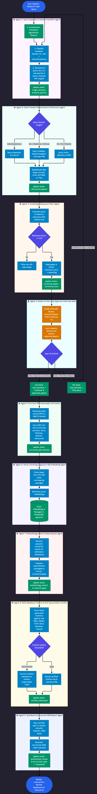
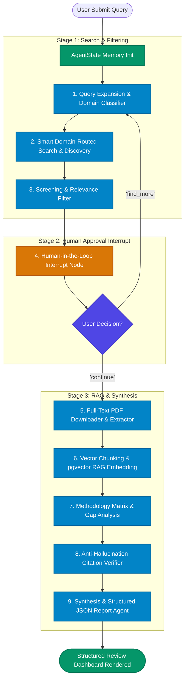
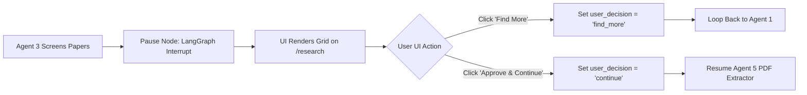

# AI & Multi-Agent Architecture

This document serves as the complete operational guide for AI/ML engineers working on the 9-Agent LangGraph academic research pipeline.

## 📌 Table of Contents
1. [Purpose & Scope](#1-purpose--scope)
2. [Folder Structure](#2-folder-structure)
3. [Models & AI Providers](#3-models--ai-providers)
4. [Setup & Running Commands](#4-setup--running-commands)
5. [9-Agent Pipeline Architecture](#5-9-agent-pipeline-architecture)
6. [Agent Definitions](#6-agent-definitions)
7. [AgentState Memory Schema](#7-agentstate-memory-schema)
8. [Human-in-the-Loop Workflow](#8-human-in-the-loop-workflow)
9. [RAG Engine & pgvector Retrieval](#9-rag-engine--pgvector-retrieval)
10. [Anti-Hallucination Citation Verification](#10-anti-hallucination-citation-verification)
11. [Structured Output Schemas](#11-structured-output-schemas)
12. [Evaluation, Cost, Latency & Model Swapping](#12-evaluation-cost-latency--model-swapping)
13. [Common Troubleshooting Issues](#13-common-troubleshooting-issues)
14. [Pre-PR Checklist](#14-pre-pr-checklist)
15. [Open Questions & Code Mismatches](#15-open-questions--code-mismatches)

---

## 1. Purpose & Scope

The AI system orchestrates a 9-agent autonomous graph using LangGraph, Google Gemini LLMs, and `pgvector` RAG to discover, screen, parse, chunk, verify, and synthesize literature reviews with human-in-the-loop approval.

---

## 2. Folder Structure

```
backend/app/
├── agents/             # LangGraph state graph definitions and orchestrator
│   ├── nodes/          # Individual 9 agent execution nodes (search, screening, synthesis, etc.)
│   ├── orchestrator.py # LangGraph StateGraph builder & compiled runnable pipeline
│   └── state.py        # Shared AgentState TypedDict memory schema
├── schemas/            # Pydantic structured output response validation schemas
├── services/           # Academic APIs (ArXiv, PubMed, OpenAlex), RAG vector store & PDF parsers
└── core/               # Application configuration and LLM provider keys
```

---

## 3. Models & AI Providers

| Purpose | Model Identifier | Provider | Config Location |
| :--- | :--- | :--- | :--- |
| **LLM Reasoning & Synthesis** | `gemini-3.1-flash-lite` | Google Gemini AI Studio | [backend/app/core/config.py](../backend/app/core/config.py#L21) |
| **Abstract Relevance Screening** | `gemini-3.1-flash-lite` | Google Gemini AI Studio | [backend/app/agents/nodes/screening_node.py](../backend/app/agents/nodes/screening_node.py#L12) |
| **Vector Passage Embeddings** | `all-MiniLM-L6-v2` (384D) | HuggingFace (`sentence-transformers`) | [backend/app/services/vector_service.py](../backend/app/services/vector_service.py#L27) |
| **TF-IDF Fallback Scoring** | Scikit-Learn TF-IDF | Local CPU Runtime | [backend/app/services/vector_service.py](../backend/app/services/vector_service.py#L127) |

---

## 4. Setup & Running Commands

### a) Manual Execution

**Linux / macOS**:
```bash
cd backend
source venv/bin/activate
export GEMINI_API_KEY="your-gemini-api-key"
python -c "import asyncio; from app.agents.orchestrator import build_literature_review_graph; print(build_literature_review_graph())"
```

**Windows (PowerShell)**:
```powershell
cd backend
.\venv\Scripts\Activate.ps1
$env:GEMINI_API_KEY="your-gemini-api-key"
python -c "import asyncio; from app.agents.orchestrator import build_literature_review_graph; print(build_literature_review_graph())"
```

**Run Agent Unit & Integration Tests**:
```bash
pytest backend/tests/test_agents.py -v
```

### b) Docker Execution

```bash
# Start backend service container with AI dependencies
docker compose up --build -d backend

# Inspect live agent execution logs
docker compose logs -f backend

# Run agent tests inside container
docker compose exec backend pytest backend/tests/test_agents.py -v
```

### c) Environment Variables

| Variable | Required | Default | Description |
| :--- | :--- | :--- | :--- |
| `GEMINI_API_KEY` | **Yes** | None | Google AI Studio key for LLM generation & JSON structured output |
| `DATABASE_URL` | **Yes** | None | PostgreSQL connection string with `pgvector` extension enabled |
| `REDIS_URL` | **Yes** | None | Redis connection string for real-time WebSocket event streaming |

---

## 5. 9-Agent Pipeline Architecture





---

## 6. Agent Definitions

| # | Agent Name | Input State | Output State | Checkpoint Description |
| :---: | :--- | :--- | :--- | :--- |
| **01** | **Query Expansion & Classifier** | `user_query` | `target_domains`, `search_queries` | Deconstructs topic into 3-5 domain sub-queries |
| **02** | **Multi-Source Discovery** | `search_queries`, `target_domains` | `discovered_papers` | Fetches papers across ArXiv, PubMed, OpenAlex, Europe PMC |
| **03** | **Screening & Relevance Filter** | `discovered_papers`, `user_query` | `screened_papers` | Scores abstracts ($\ge 0.6$) using Gemini LLM reasoning |
| **04** | **Human Approval Interrupt** | `screened_papers` | `approved_papers`, `user_decision` | Pauses graph for user paper selection on frontend |
| **05** | **PDF Extractor** | `approved_papers` | `extracted_pdf_contents` | Downloads open-access PDFs and parses section headers |
| **06** | **`pgvector` RAG Agent** | `extracted_pdf_contents` | `PaperChunk` DB records | Chunks passages (500 tokens) and generates 384D embeddings |
| **07** | **Gap Analysis Agent** | `approved_papers`, `PaperChunk` | `methodology_matrix`, `gaps` | Maps experimental paradigms & isolates research gaps |
| **08** | **Anti-Hallucination Verifier** | Generated citations | `verified_references` | Cross-checks references against real DOIs/PMIDs/ArXiv IDs |
| **09** | **Synthesis Report Agent** | `verified_references`, RAG contexts | `synthesized_review` | Synthesizes Pydantic structured review JSON payload |

---

## 7. AgentState Memory Schema

Defined in [backend/app/agents/state.py](../backend/app/agents/state.py#L7-L21):

| Field Name | Data Type | Mutated / Set By Node | Description |
| :--- | :--- | :--- | :--- |
| `user_query` | `str` | Entry point | Original user research topic |
| `target_domains` | `List[str]` | Agent 1 | Identified domains (e.g., `["cs", "bio"]`) |
| `search_queries` | `List[str]` | Agent 1 | Generated sub-queries for academic APIs |
| `discovered_papers` | `Annotated[List[dict], add]` | Agent 2 | Deduplicated raw academic search results |
| `screened_papers` | `List[dict]` | Agent 3 | Relevance-scored papers ($\ge 0.6$) |
| `approved_papers` | `List[dict]` | Agent 4 (Human) | Papers selected by user for full synthesis |
| `user_decision` | `str` | Agent 4 (Human) | Decision flag: `"continue"` or `"find_more"` |
| `extracted_pdf_contents`| `Dict[str, Any]` | Agent 5 | Parsed section dictionary per approved paper |
| `verified_references` | `List[dict]` | Agent 8 | Validated reference objects with canonical URLs |
| `synthesized_review` | `Dict[str, Any]` | Agent 9 | Final structured literature review document |
| `current_step` | `str` | Orchestrator | Current active node name for progress tracking |

---

## 8. Human-in-the-Loop Workflow



---

## 9. RAG Engine & pgvector Retrieval

| Parameter | Code Base Value | Implementation Plan Value | Description |
| :--- | :--- | :--- | :--- |
| **Embedding Model** | `all-MiniLM-L6-v2` | OpenAI / Gemini Embedding | Free local sentence-transformers model |
| **Vector Dimension** | `384` | `1536` | Dimension stored in `pgvector` column |
| **Passage Chunk Size** | `500` characters | `500` tokens | Window length for passage segmentation |
| **Chunk Overlap** | `50` characters | `50` tokens | Sliding overlap between adjacent chunks |
| **Similarity Metric** | Cosine Distance | Cosine Distance | Measured via `embedding.cosine_distance()` |
| **Top K Retrieval** | `5` passages | `5-10` passages | Chunks retrieved per RAG prompt query |

---

## 10. Anti-Hallucination Citation Verification

Agent 8 validates every reference generated in the review report against canonical database identifiers:

1. **Extraction**: Collects all cited DOIs, PMIDs, and ArXiv IDs from the LLM synthesis draft.
2. **Database Verification**: Queries OpenAlex/Crossref/PubMed REST APIs to verify title and author matches.
3. **Correction & Removal**: If a citation fails verification or has no ground-truth DOI, the claim is flagged or restructured without fake citations.

---

## 11. Structured Output Schemas

Agent 9 emits a structured JSON object validated via Pydantic:

| Section Key | Data Structure | Purpose |
| :--- | :--- | :--- |
| `executive_summary` | `str` | High-level synthesis of current state of research |
| `thematic_clusters` | `List[Dict[str, Any]]` | Core themes grouping key methodologies and findings |
| `methodology_matrix` | `List[Dict[str, Any]]` | Comparative table of datasets, models, and accuracy metrics |
| `research_gaps` | `List[Dict[str, Any]]` | Identified open challenges and potential research directions |
| `verified_references` | `List[Dict[str, Any]]` | Grounded citations with DOIs, PMIDs, and 5-style formatting |

---

## 12. Evaluation, Cost, Latency & Model Swapping

- **Cost**: `all-MiniLM-L6-v2` local embeddings cost \$0.00. Gemini 3.1 Flash Lite offers sub-cent execution cost per review run.
- **Latency**: Sub-30s graph completion with sub-5ms WebSocket checkpoint pushes via Redis.
- **How to Swap LLM Model**: Update default `model_name` parameter in `ChatGoogleGenerativeAI(model="gemini-3.1-flash-lite")`.
- **How to Swap Embedding Model**: Modify `_ST_MODEL` in [backend/app/services/vector_service.py](../backend/app/services/vector_service.py#L27) and update `EMBEDDING_DIMENSION` in [backend/app/models/chunk.py](../backend/app/models/chunk.py#L28).

---

## 13. Common Troubleshooting Issues

| Problem | Cause | Fix |
| :--- | :--- | :--- |
| `SentenceTransformer download timeout` | Firewall/network blocking HuggingFace Hub | Set `HF_HUB_ENABLE_HF_TRANSFER=0` or pre-download model |
| `ResourceExhausted 429` | Gemini API rate limit exceeded | Add backoff retries or switch to secondary Gemini API key |
| `Vector dimension mismatch (384 vs 1536)` | Model change without database migration | Drop and recreate `paper_chunks` table after changing vector size |
| `PydanticValidationError in Agent 9` | LLM JSON output missing required keys | Enforce strict Pydantic JSON Mode in Gemini LLM client |

---

## 14. Pre-PR Checklist

- [ ] Executed `pre-commit run --all-files` (Passes linting & security scans).
- [ ] Executed `pytest backend/tests/test_agents.py -v` (100% agent test pass rate).
- [ ] Verified LangGraph state transitions and human-in-the-loop pause logic.
- [ ] Confirmed zero ungrounded/hallucinated citations in test outputs.

---

## 15. Open Questions & Code Mismatches

| Topic | Codebase Value | Implementation Plan Value | Action Required |
| :--- | :--- | :--- | :--- |
| **Embedding Model & Dimension** | `all-MiniLM-L6-v2` (`384D`) | OpenAI / Gemini (`1536D`) | Decide whether to standardize on 384D local embeddings or migrate to 1536D API embeddings |
| **LLM Model Name** | `gemini-3.1-flash-lite` | `gemini-3.1-flash-lite` / `gemini-2.0-flash` | Confirm default production LLM model string across all node definitions |
| **Chunk Window Definition** | Character length in `vector_service.py` | Token count in implementation plan | Update chunker logic to use tiktoken/token-based splitter |
