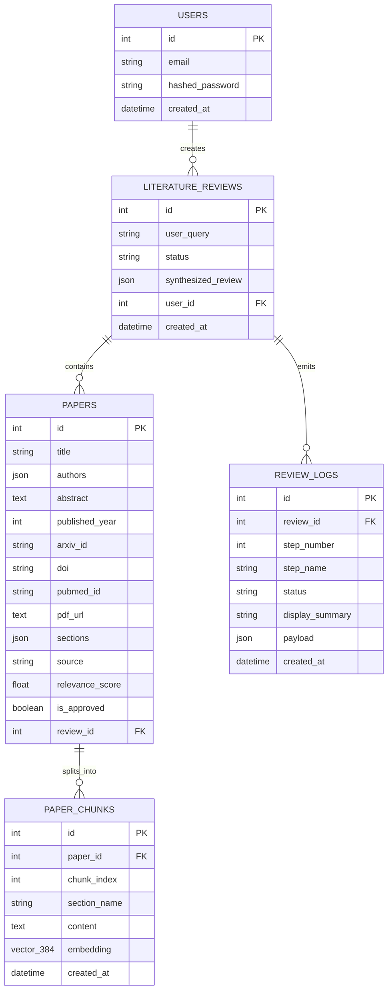

# Backend Documentation

## 📌 Table of Contents
1. [Purpose & Scope](#1-purpose--scope)
2. [Folder Structure](#2-folder-structure)
3. [Tech Stack](#3-tech-stack)
4. [Core Backend Services](#4-core-backend-services)
5. [Setup & Running Commands](#5-setup--running-commands)
6. [Environment Variables](#6-environment-variables)
7. [API Endpoints](#7-api-endpoints)
8. [WebSocket Event Streaming](#8-websocket-event-streaming)
9. [Database Schema & ER Diagram](#9-database-schema--er-diagram)
10. [Authentication Flow](#10-authentication-flow)
11. [Citation Formatter (5 Styles)](#11-citation-formatter-5-styles)
12. [Error Codes & Migration Commands](#12-error-codes--migration-commands)
13. [Common Troubleshooting Issues](#13-common-troubleshooting-issues)
14. [Pre-PR Checklist](#14-pre-pr-checklist)
15. [Open Questions & Code Mismatches](#15-open-questions--code-mismatches)

---

## 1. Purpose & Scope

The backend service is built with FastAPI, LangGraph, and PostgreSQL + `pgvector`. It handles multi-source academic paper search, relevance filtering, PDF section extraction, vector RAG retrieval, citation verification, and structured report synthesis.

---

## 2. Folder Structure

```
backend/
├── app/
│   ├── agents/         # LangGraph AgentState memory, orchestrator graph, and agent nodes
│   ├── api/            # FastAPI route handlers and API v1 endpoint modules
│   ├── core/           # Application configuration, settings, and environment variables
│   ├── db/             # SQLAlchemy async engine, session factory, and base definitions
│   ├── models/         # SQLAlchemy ORM models (LiteratureReview, Paper, PaperChunk, User, Log)
│   ├── schemas/        # Pydantic request and response schemas
│   └── services/       # Academic search, PDF parser, Redis cache, and vector store services
├── tests/              # Pytest backend test suite
├── Dockerfile          # Backend container definition (python:3.11-slim)
└── requirements.txt    # Python dependencies manifest
```

---

## 3. Tech Stack

| Technology | Version | Purpose in Backend |
| :--- | :--- | :--- |
| **Python** | `3.11` | Primary async runtime configured in [Dockerfile](../backend/Dockerfile#L2) |
| **FastAPI** | `>=0.110.0` | Asynchronous web framework for REST and WebSockets |
| **Uvicorn** | `>=0.28.0` | ASGI web server for running FastAPI |
| **SQLAlchemy** | `>=2.0.0` | Asynchronous ORM database mapper |
| **AsyncPG** | `>=0.29.0` | Asynchronous PostgreSQL database driver |
| **PostgreSQL + pgvector** | `pgvector >=0.2.5` | Cloud database storage & vector similarity search |
| **Redis** | `>=5.0.0` | In-memory cache and real-time Pub/Sub event broker |
| **LangGraph** | `>=0.2.0` | Multi-agent stateful graph orchestration engine |
| **LangChain / Google GenAI**| `>=0.3.0` / `>=2.0.0` | Gemini LLM integration (`gemini-3.1-flash-lite`) |
| **Scikit-Learn** | `>=1.4.0` | TF-IDF relevance scoring fallback |
| **PyPDF / DefusedXML** | `>=5.0.0` / `>=0.7.1` | PDF text parsing and secure XML processing |

---

## 4. Core Backend Services

| Service Module | Source File | Purpose & Responsibilities | Key Functions |
| :--- | :--- | :--- | :--- |
| **Redis Cache & Pub/Sub** | [redis_service.py](../backend/app/services/redis_service.py) | Global async Redis client management, search query result caching with TTL (`3600s`/`86400s`), JSON serialization, and health ping checks. | `get_redis_client()`, `get_cached_query()`, `set_cached_query()`, `check_redis_connection()` |
| **Async PDF Extractor** | [pdf_service.py](../backend/app/services/pdf_service.py) | Asynchronous HTTP PDF binary download via `httpx`, multi-page text extraction via `PyPDF`, regex normalization, and section parsing (`Abstract`, `Methods`, `Results`, `Limitations`). | `download_and_extract_pdf()`, `_download_pdf()`, `_extract_pdf_text()`, `_extract_sections()` |
| **Multi-Source Academic Search** | [search_service.py](../backend/app/services/search_service.py) | Concurrent paper discovery across ArXiv, PubMed, Semantic Scholar, and Crossref with exponential backoff retry for 429 rate limits and XML parsing. | `search_academic_papers()`, `_search_arxiv()`, `_search_pubmed()`, `_search_semantic_scholar()`, `_search_crossref()` |
| **Vector RAG & Embeddings** | [vector_service.py](../backend/app/services/vector_service.py) | Text passage chunking (500 tokens, 50 overlap), local 384D embedding generation (`all-MiniLM-L6-v2`), `paper_chunks` storage, and `pgvector` similarity search. | `generate_embedding()`, `chunk_text()`, `store_paper_chunks()`, `similarity_search()` |

### Service Architecture Details

- **Redis Caching**: Caches raw API queries using SHA keys with a default TTL of 3600 seconds to prevent redundant academic API requests.
- **HTTP PDF Parser**: Fetches open-access PDF streams, parses text into section buffers, and normalizes headings using regex alias matching.
- **Search Aggregator**: Executes parallel `asyncio.gather` requests across 4 academic APIs and caches consolidated responses in Redis.
- **Vector Store**: Handles passage chunking, embedding calculation, and executing SQL `cosine_distance` queries over `paper_chunks`.

---

## 5. Setup & Running Commands

### a) Manual Server Setup

**Linux / macOS**:
```bash
cd backend
python3 -m venv venv
source venv/bin/activate
pip install -r requirements.txt
uvicorn app.main:app --host 0.0.0.0 --port 8000 --reload
```

**Windows (PowerShell)**:
```powershell
cd backend
python -m venv venv
.\venv\Scripts\Activate.ps1
pip install -r requirements.txt
uvicorn app.main:app --host 0.0.0.0 --port 8000 --reload
```

**Run Backend Test Suite**:
```bash
pytest backend/tests -v
```

### b) Docker Container Commands

```bash
# Build and run backend container stack
docker compose up --build -d

# View live backend container logs
docker compose logs -f backend

# Execute commands inside running backend container
docker compose exec backend pytest backend/tests -v

# Stop containers
docker compose down
```

---

## 6. Environment Variables

| Variable Name | Required | Default Value | Description |
| :--- | :--- | :--- | :--- |
| `DATABASE_URL` | **Yes** | None | PostgreSQL connection string (`postgresql://...`) |
| `REDIS_URL` | **Yes** | None | Redis connection string (`rediss://...`) |
| `GEMINI_API_KEY` | **Yes** | None | Google AI Studio API Key (`AIzaSy...`) |
| `PROJECT_NAME` | No | `"Multi-Agent Academic Research Assistant"` | FastAPI application title |
| `API_V1_STR` | No | `"/api/v1"` | API v1 route prefix |
| `ENVIRONMENT` | No | `"development"` | Active runtime environment |

---

## 7. API Endpoints

| Method | Path | Auth | Request Body | Response Payload |
| :--- | :--- | :--- | :--- | :--- |
| `GET` | `/api/v1/health` | None | None | `{ "status": "healthy", "database": "connected", "redis": "connected" }` |
| `POST` | `/api/v1/reviews/` | Optional | `{ "query": "string", "max_papers": 10 }` | `{ "review_id": 1, "status": "pending" }` |
| `GET` | `/api/v1/reviews/` | Optional | None | `List[{ "id": 1, "user_query": "string", "status": "string" }]` |
| `GET` | `/api/v1/reviews/{id}` | Optional | None | `{ "id": 1, "user_query": "string", "synthesized_review": {...} }` |
| `POST` | `/api/v1/reviews/approve` | Optional | `{ "approved_paper_ids": [1, 2], "user_decision": "continue" }` | `{ "status": "approved", "approved_count": 2 }` |
| `GET` | `/api/v1/reviews/{id}/checkpoints` | Optional | None | `List[{ "checkpoint": 1, "title": "string", "display_summary": "string" }]` |
| `GET` | `/api/v1/reviews/{id}/citations` | Optional | Query `?style=APA` | `List[{ "key": "Smith2023", "formatted_citation": "string" }]` |
| `POST` | `/api/v1/auth/signup` | None | `{ "email": "user@example.com", "password": "pass" }` | `{ "user_id": 1, "token": "jwt-string" }` |
| `POST` | `/api/v1/auth/login` | None | `{ "email": "user@example.com", "password": "pass" }` | `{ "token": "jwt-string", "token_type": "bearer" }` |

---

## 8. WebSocket Event Streaming

- **URL**: `ws://localhost:8000/api/v1/reviews/{id}/ws`
- **Redis Channel**: `review:{id}:events`
- **JSON Event Frame Example**:

```json
{
  "event": "checkpoint_update",
  "review_id": 42,
  "checkpoint": 3,
  "status": "completed",
  "title": "Relevance Filter Completed",
  "display_summary": "Screened 24 papers -> 10 relevant papers retained (Avg score: 0.88)",
  "payload": {
    "screened_count": 10,
    "top_score": 0.94
  },
  "timestamp": "2026-10-01T11:20:00Z"
}
```

---

## 9. Database Schema & ER Diagram



### Table Definitions

| Table Name | Primary Key | Key Columns | Description |
| :--- | :--- | :--- | :--- |
| `users` | `id` (Int) | `email`, `hashed_password` | User identity table for authentication |
| `literature_reviews` | `id` (Int) | `user_query`, `status`, `synthesized_review` (JSON), `user_id` (FK) | Review session storage |
| `papers` | `id` (Int) | `title`, `abstract`, `sections` (JSON), `relevance_score`, `is_approved`, `review_id` (FK) | Academic paper metadata & sections |
| `paper_chunks` | `id` (Int) | `paper_id` (FK), `section_name`, `content`, `embedding` (`Vector(384)`) | `pgvector` passage embeddings |
| `review_logs` | `id` (Int) | `review_id` (FK), `step_number`, `step_name`, `status`, `display_summary`, `payload` (JSON) | Timeline event logs |

---

## 10. Authentication Flow

| Step | Action | Endpoint / Header | Behavior |
| :---: | :--- | :--- | :--- |
| **1** | User Signup | `POST /api/v1/auth/signup` | Hashes password, creates `User` record, returns JWT bearer token |
| **2** | User Login | `POST /api/v1/auth/login` | Verifies password hash against `users` table, returns JWT bearer token |
| **3** | Request Authorization | `Authorization: Bearer <token>` | Client passes JWT in HTTP Authorization header |
| **4** | Protected Route Access | `/api/v1/reviews/*` | Middleware decodes JWT, extracts `user_id`, and enforces row-level privacy |

---

## 11. Citation Formatter (5 Styles)

| Style | Example Output | How Generated |
| :--- | :--- | :--- |
| **APA** | Smith, A., & Jones, B. (2023). *Deep Convolutional Networks in Mammography*. ArXiv:2301.00001. | Formatted via author list, publication year, sentence-case title, and identifier. |
| **IEEE** | [1] A. Smith and B. Jones, "Deep Convolutional Networks in Mammography," *arXiv:2301.00001*, 2023. | Formatted with numerical index, initial-last author name structure, and title quotes. |
| **MLA** | Smith, Alice, and Bob Jones. "Deep Convolutional Networks in Mammography." *arXiv*, 2023, arXiv:2301.00001. | Formatted with full author names, title case, and repository container name. |
| **Harvard** | Smith, A. and Jones, B. (2023) 'Deep Convolutional Networks in Mammography', *arXiv*. Available at: https://arxiv.org/abs/2301.00001. | Formatted with single title quotes, italic container, and URL link. |
| **Chicago** | Smith, Alice, and Bob Jones. "Deep Convolutional Networks in Mammography." *arXiv* (2023). https://doi.org/10.1038/s41586-023-00001. | Formatted with full names, title quotes, container, and DOI URL. |

---

## 12. Error Codes & Migration Commands

### Error Codes Table

| Code | HTTP Status | Meaning | Resolution |
| :--- | :--- | :--- | :--- |
| `400 Bad Request` | `400` | Invalid request parameters or JSON payload | Check request body arguments |
| `401 Unauthorized` | `401` | Missing or invalid JWT bearer token | Re-authenticate at `/api/v1/auth/login` |
| `404 Not Found` | `404` | Literature review or paper ID does not exist | Verify resource ID |
| `429 Too Many Requests` | `429` | External search API rate limit reached | Automatic retry backoff handled in `search_service.py` |
| `500 Internal Server Error` | `500` | Unhandled database or server exception | Check application logs in terminal / Uvicorn |

### Database Initialization & Migration Commands

Database tables and `pgvector` extensions are initialized automatically on FastAPI application startup via [backend/app/main.py](../backend/app/main.py#L25-L30):

```bash
# Verify automatic table creation log on startup
python -c "import asyncio; from app.main import lifespan; print('Lifespan DB Init handles CREATE EXTENSION IF NOT EXISTS vector')"
```

---

## 13. Common Troubleshooting Issues

| Problem | Cause | Fix |
| :--- | :--- | :--- |
| `ModuleNotFoundError: No module named 'sklearn'` | Virtualenv missing newly added dependencies | Run `pip install -r requirements.txt` |
| `asyncpg.Error: password authentication failed` | Invalid credentials in `DATABASE_URL` | Verify Neon DB credentials in `.env` |
| `TypeError: connect() got unexpected keyword argument 'sslmode'` | `sslmode=require` query param incompatible with asyncpg | Remove `?sslmode=require` query param and pass `connect_args={"ssl": "require"}` |

---

## 14. Pre-PR Checklist

Before submitting a Pull Request, verify:
- [ ] Ran `pre-commit run --all-files` (Passes Ruff, Black, Bandit, file hygiene).
- [ ] Ran `pytest backend/tests -v` (Passes 100% of backend tests).
- [ ] Ensured all async database sessions are cleanly closed.

---

## 15. Open Questions & Code Mismatches

| Topic | Codebase Value | Implementation Plan Value | Action Required |
| :--- | :--- | :--- | :--- |
| **Paper Approval Endpoint Path** | `POST /api/v1/reviews/approve` in [backend/app/api/v1/health.py](../backend/app/api/v1/health.py#L76) | `POST /api/v1/reviews/{id}/approve` | **Action Required**: Refactor paper approval route into `backend/app/api/v1/reviews.py`. |
| **Embedding Vector Dimension** | `Vector(384)` in [backend/app/models/chunk.py](../backend/app/models/chunk.py#L28) | `1536-dimensional vector embeddings` | **Action Required**: Update vector dimension in `PaperChunk` model when updating embedding model. |
| **Passage Chunk Size** | `chunk_size=1000`, `overlap=200` in [backend/app/services/vector_service.py](../backend/app/services/vector_service.py#L25) | `500-token passages with 50-token overlap` | **Action Required**: Update `vector_service.py` default chunk parameters to 500 tokens. |
| **Authentication Endpoints** | Model defined in [backend/app/models/user.py](../backend/app/models/user.py) | Full auth flow specification | **Action Required**: Implement login and signup route handlers under `/api/v1/auth`. |
