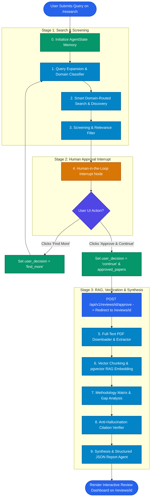
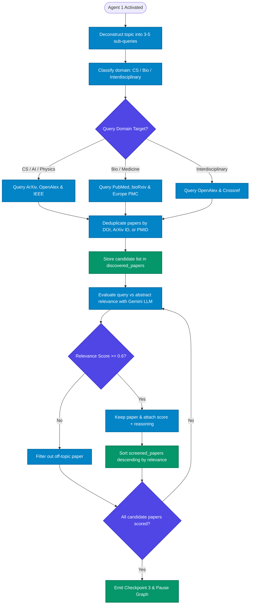
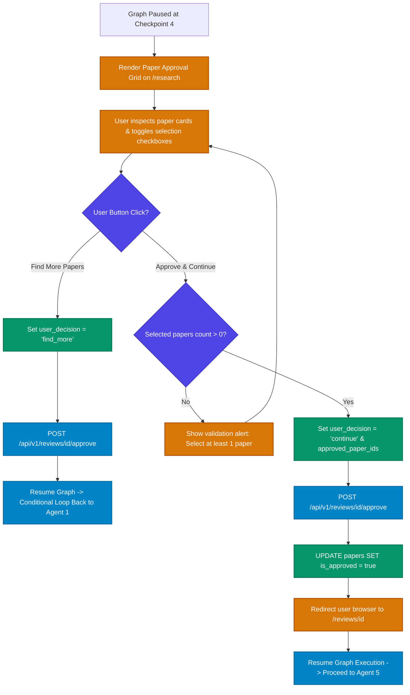
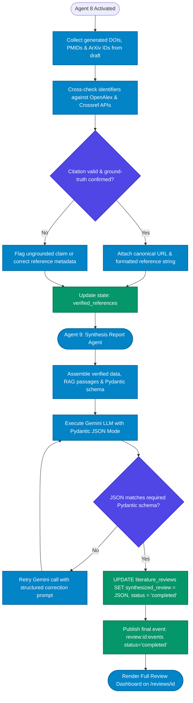
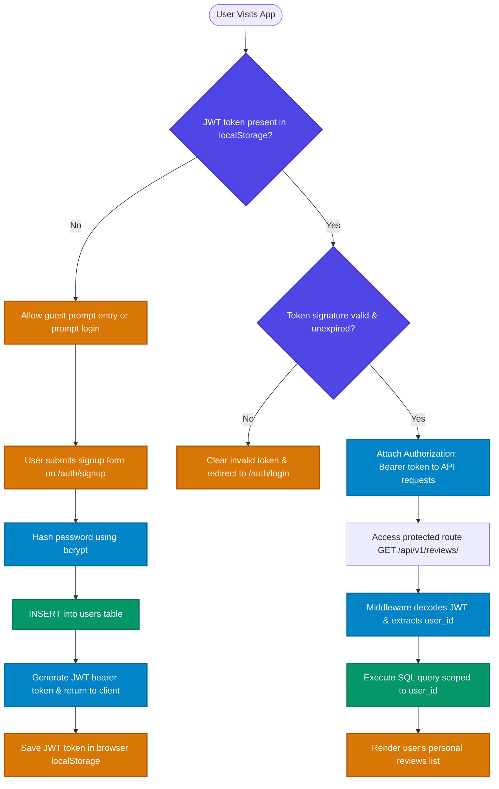
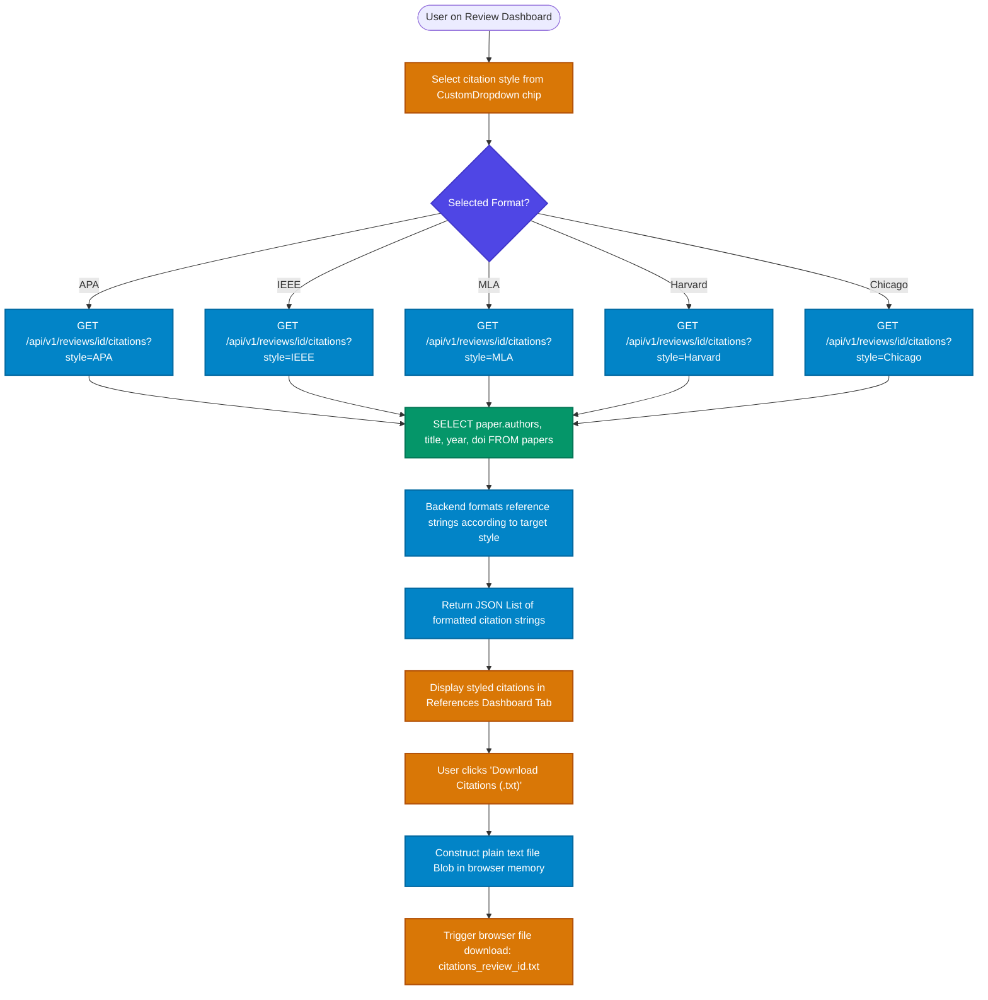

# Activity Diagrams

This document contains end-to-end activity diagrams visualizing control flow across the 9-agent research pipeline, human-in-the-loop paper approval, vector RAG indexing, citation verification, authentication, and multi-style citation export.

## 📌 Table of Contents
1. [1. End-to-End 9-Agent Pipeline Overview](#1-end-to-end-9-agent-pipeline-overview)
2. [2. Search Discovery & Abstract Screening Activity](#2-search-discovery--abstract-screening-activity)
3. [3. Human Approval & "Find More" Loop Activity](#3-human-approval--find-more-loop-activity)
4. [4. PDF Extraction & Vector RAG Indexing Activity](#4-pdf-extraction--vector-rag-indexing-activity)
5. [5. Citation Verification & Structured Report Synthesis Activity](#5-citation-verification--structured-report-synthesis-activity)
6. [6. User Authentication & Session Security Activity](#6-user-authentication--session-security-activity)
7. [7. 5-Style Citation Selection & Download Activity](#7-5-style-citation-selection--download-activity)

---

## 1. End-to-End 9-Agent Pipeline Overview

High-level activity flowchart outlining the complete 9-agent execution graph from prompt submission to structured literature review dashboard rendering.

| Element | Meaning | Code Reference |
| :--- | :--- | :--- |
| `AgentState` | Shared TypedDict memory state | [backend/app/agents/state.py](../../backend/app/agents/state.py#L7) |
| `build_literature_review_graph()` | LangGraph graph builder | [backend/app/agents/orchestrator.py](../../backend/app/agents/orchestrator.py#L4) |
| `POST /api/v1/reviews/{id}/approve` | Approval transition endpoint | [backend/app/api/v1/reviews.py](../../backend/app/api/v1/reviews.py#L53) |

---

## 2. Search Discovery & Abstract Screening Activity

Detailed activity flowchart for Agents 1, 2, and 3 covering sub-query generation, multi-repository API search, deduplication, and LLM relevance filtering.

| Element | Meaning | Code Reference |
| :--- | :--- | :--- |
| `search_academic_papers()` | Multi-source API search wrapper | [backend/app/services/search_service.py](../../backend/app/services/search_service.py#L356) |
| `screening_node.py` | Gemini LLM abstract relevance scorer | [backend/app/agents/nodes/screening_node.py](../../backend/app/agents/nodes/screening_node.py) |
| `screened_papers` | Relevance-filtered paper array | [backend/app/agents/state.py](../../backend/app/agents/state.py#L14) |

---

## 3. Human Approval & "Find More" Loop Activity

Control flow activity diagram for Agent 4 human-in-the-loop interaction on the frontend `/research` page.

| Element | Meaning | Code Reference |
| :--- | :--- | :--- |
| `PaperGrid` | Interactive paper selection grid | [frontend/src/components/dashboard/paper-grid.tsx](../../frontend/src/components/dashboard/paper-grid.tsx) |
| `submitHumanDecision()` | Frontend decision API submitter | [frontend/src/lib/api.ts](../../frontend/src/lib/api.ts#L34) |
| `approve_papers()` | Backend approval route handler | [backend/app/api/v1/reviews.py](../../backend/app/api/v1/reviews.py#L53) |

---

## 4. PDF Extraction & Vector RAG Indexing Activity

Activity diagram covering Agent 5 (PDF download & section regex extraction), Agent 6 (500-token chunking & 384D embedding generation into `pgvector`), and Agent 7 (Gap Analysis).

```mermaid
flowchart TD
    classDef process fill:#0284c7,color:#fff,stroke:#0369a1,stroke-width:2px;
    classDef decision fill:#4f46e5,color:#fff,stroke:#4338ca,stroke-width:2px;
    classDef db fill:#059669,color:#fff,stroke:#047857,stroke-width:2px;

    Start([Agent 5 Started]) --> FetchApproved["Fetch list of approved papers"]:::db
    FetchApproved --> DownloadPDF["Download open-access PDF binary via httpx"]:::process
    DownloadPDF --> ParseText["Extract text pages via PyPDF"]:::process
    ParseText --> ExtractSections["Regex match section headers: Intro, Methods, Results, Discussion"]:::process
    ExtractSections --> SaveSections["Store section dictionary in DB paper.sections"]:::db

    SaveSections --> Agent6(["Agent 6: Vector RAG Indexer"]):::process
    Agent6 --> ChunkText["Segment paper text into 500-token passages (50 overlap)"]:::process
    ChunkText --> GenEmbeddings["Generate 384D embeddings via sentence-transformers (all-MiniLM-L6-v2)"]:::process
    GenEmbeddings --> InsertVector["INSERT PaperChunk records with Vector(384) into PostgreSQL pgvector"]:::db

    InsertVector --> Agent7(["Agent 7: Gap Analysis Agent"]):::process
    Agent7 --> VectorSearch["Execute pgvector cosine distance search for experimental paradigms"]:::process
    VectorSearch --> MapMatrix["Construct Methodology Comparison Matrix"]:::process
    MapMatrix --> ExtractGaps["Isolate unresolved research gaps and limitations"]:::process
    ExtractGaps --> SaveGaps["Update state: methodology_matrix & research_gaps"]:::db
```

| Element | Meaning | Code Reference |
| :--- | :--- | :--- |
| `download_and_extract_pdf()` | Async PDF downloader & section parser | [backend/app/services/pdf_service.py](../../backend/app/services/pdf_service.py#L185) |
| `store_paper_chunks()` | Passage chunker & 384D embedding generator | [backend/app/services/vector_service.py](../../backend/app/services/vector_service.py#L140) |
| `PaperChunk` | `pgvector` database ORM model | [backend/app/models/chunk.py](../../backend/app/models/chunk.py#L28) |

---

## 5. Citation Verification & Structured Report Synthesis Activity

Activity diagram for Agent 8 anti-hallucination citation cross-referencing and Agent 9 structured Pydantic JSON synthesis.

| Element | Meaning | Code Reference |
| :--- | :--- | :--- |
| `synthesis_node.py` | Pydantic JSON literature review synthesizer | [backend/app/agents/nodes/synthesis_node.py](../../backend/app/agents/nodes/synthesis_node.py) |
| `literature_reviews` | Review storage database table | [backend/app/models/review.py](../../backend/app/models/review.py) |
| `redis_service.py` | Real-time event publisher | [backend/app/services/redis_service.py](../../backend/app/services/redis_service.py) |

---

## 6. User Authentication & Session Security Activity

Control flow activity diagram detailing user registration, password hashing, login token generation, and protected API route authorization.

| Element | Meaning | Code Reference |
| :--- | :--- | :--- |
| `users` | User authentication database model | [backend/app/models/user.py](../../backend/app/models/user.py) |
| `api.ts` | Frontend JWT storage & header injector | [frontend/src/lib/api.ts](../../frontend/src/lib/api.ts) |
| `Dashboard.tsx` | Authenticated dashboard page view | [frontend/src/pages/Dashboard.tsx](../../frontend/src/pages/Dashboard.tsx) |

---

## 7. 5-Style Citation Selection & Download Activity

Activity diagram illustrating citation format selection (APA, IEEE, MLA, Harvard, Chicago) and client-side `.txt` file export.

| Element | Meaning | Code Reference |
| :--- | :--- | :--- |
| `citationOptions` | 5-style dropdown configuration | [frontend/src/components/ResearchInput.tsx](../../frontend/src/components/ResearchInput.tsx#L109-L115) |
| `CustomDropdown` | Dropdown selector component | [frontend/src/components/ResearchInput.tsx](../../frontend/src/components/ResearchInput.tsx#L9) |
| `GET /api/v1/reviews/{id}/citations` | Citation formatting API route | [backend/app/api/v1/reviews.py](../../backend/app/api/v1/reviews.py) |
