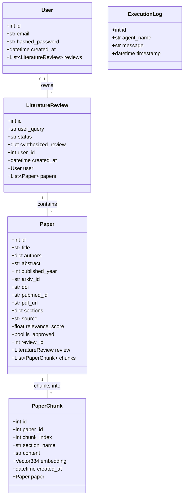
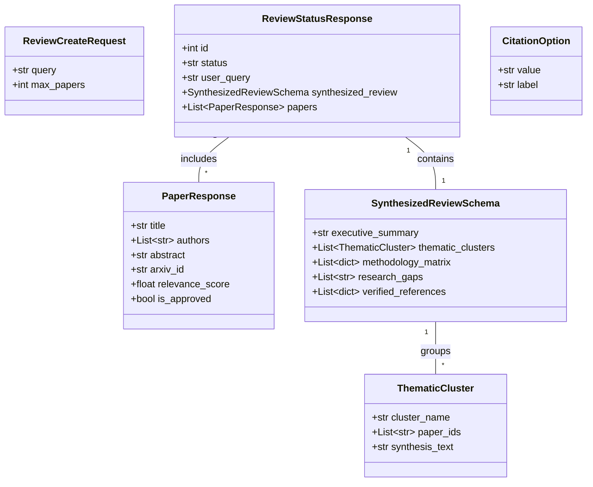
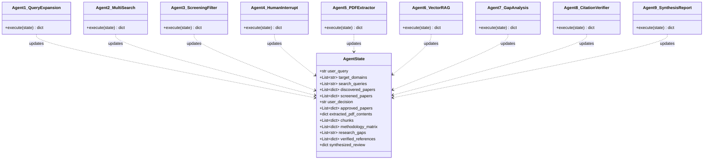
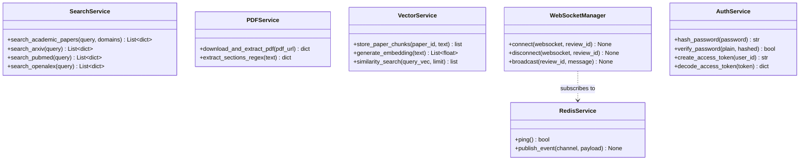
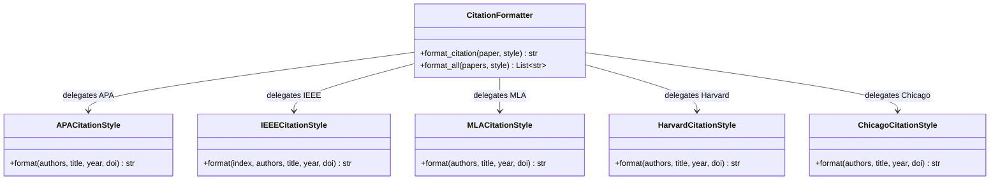

# Class Diagrams

This document contains class diagrams visualizing database ORM models, Pydantic schemas, LangGraph multi-agent memory states, core backend infrastructure services, 5-style citation formatters, and frontend React client components.

## 📌 Table of Contents
1. [1. Database Models & Entity-Relationship Architecture](#1-database-models--entity-relationship-architecture)
2. [2. Pydantic API Schemas & Synthesis DTOs](#2-pydantic-api-schemas--synthesis-dtos)
3. [3. LangGraph Multi-Agent Architecture & Memory State](#3-langgraph-multi-agent-architecture--memory-state)
4. [4. Core Infrastructure Services Architecture](#4-core-infrastructure-services-architecture)
5. [5. 5-Style Citation Selection & Formatter Architecture](#5-5-style-citation-selection--formatter-architecture)

---

## 1. Database Models & Entity-Relationship Architecture

Class diagram depicting SQLAlchemy ORM database models, table column structures, foreign key constraints, and 1-to-N relationships.

| Class | Responsibility | Code reference (file path) |
|---|---|---|
| `User` | User account ORM model for authentication & ownership | [backend/app/models/user.py](../../backend/app/models/user.py#L19) |
| `LiteratureReview` | Session model storing research query & synthesis state | [backend/app/models/review.py](../../backend/app/models/review.py#L20) |
| `Paper` | Academic paper metadata & approval status | [backend/app/models/paper.py](../../backend/app/models/paper.py#L22) |
| `PaperChunk` | Text passage chunk & 384D pgvector embedding | [backend/app/models/chunk.py](../../backend/app/models/chunk.py#L16) |
| `ExecutionLog` | Agent execution audit trail & log model | [backend/app/models/log.py](../../backend/app/models/log.py#L15) |

---

## 2. Pydantic API Schemas & Synthesis DTOs

Class diagram depicting Pydantic data transfer objects (DTOs) used for API request validation, response serialization, and structured Gemini JSON synthesis.

| Class | Responsibility | Code reference (file path) |
|---|---|---|
| `ReviewCreateRequest` | Payload schema for initiating review tasks | [backend/app/schemas/review.py](../../backend/app/schemas/review.py#L6) |
| `PaperResponse` | DTO schema for paper details & screening scores | [backend/app/schemas/paper.py](../../backend/app/schemas/paper.py#L6) |
| `ReviewStatusResponse` | DTO schema for review session & synthesis status | [backend/app/api/v1/reviews.py](../../backend/app/api/v1/reviews.py#L43) |
| `SynthesizedReviewSchema` | Pydantic JSON structure for Gemini synthesis report | [backend/app/agents/nodes/synthesis_node.py](../../backend/app/agents/nodes/synthesis_node.py) |
| `ThematicCluster` | Nested cluster schema grouping research themes | [backend/app/agents/nodes/synthesis_node.py](../../backend/app/agents/nodes/synthesis_node.py) |
| `CitationOption` | DTO for 5-style citation selection dropdown | [frontend/src/components/ResearchInput.tsx](../../frontend/src/components/ResearchInput.tsx#L109) |

---

## 3. LangGraph Multi-Agent Architecture & Memory State

Class diagram showing the 9 specialized AI agent nodes and their shared `AgentState` TypedDict graph memory structure.

| Class | Responsibility | Code reference (file path) |
|---|---|---|
| `AgentState` | Shared TypedDict memory passed across all graph nodes | [backend/app/agents/state.py](../../backend/app/agents/state.py#L7) |
| `Agent1_QueryExpansion` | Deconstructs topic query into sub-queries & classifies domain | [backend/app/agents/orchestrator.py](../../backend/app/agents/orchestrator.py) |
| `Agent2_MultiSearch` | Queries ArXiv, PubMed, OpenAlex & deduplicates papers | [backend/app/agents/nodes/search_node.py](../../backend/app/agents/nodes/search_node.py) |
| `Agent3_ScreeningFilter` | Scores paper abstract relevance via Gemini LLM (>= 0.6) | [backend/app/agents/nodes/screening_node.py](../../backend/app/agents/nodes/screening_node.py) |
| `Agent4_HumanInterrupt` | Pauses pipeline for human paper approval / find-more loop | [backend/app/agents/orchestrator.py](../../backend/app/agents/orchestrator.py) |
| `Agent5_PDFExtractor` | Downloads open-access PDFs & parses sections via PyPDF | [backend/app/services/pdf_service.py](../../backend/app/services/pdf_service.py#L185) |
| `Agent6_VectorRAG` | Chunks text (500 tokens) & generates 384D embeddings | [backend/app/services/vector_service.py](../../backend/app/services/vector_service.py#L140) |
| `Agent7_GapAnalysis` | Semantic search for experimental paradigms & gaps | [backend/app/agents/orchestrator.py](../../backend/app/agents/orchestrator.py) |
| `Agent8_CitationVerifier` | Cross-checks DOIs/PMIDs against OpenAlex & Crossref | [backend/app/agents/nodes/synthesis_node.py](../../backend/app/agents/nodes/synthesis_node.py) |
| `Agent9_SynthesisReport` | Synthesizes structured JSON literature review report | [backend/app/agents/nodes/synthesis_node.py](../../backend/app/agents/nodes/synthesis_node.py) |

---

## 4. Core Infrastructure Services Architecture

Class diagram illustrating backend infrastructure services including search clients, PDF parsing, pgvector storage, Redis Pub/Sub, WebSocket connection management, and JWT auth.

| Class | Responsibility | Code reference (file path) |
|---|---|---|
| `SearchService` | Multi-repository API search aggregator (ArXiv, PubMed, OpenAlex) | [backend/app/services/search_service.py](../../backend/app/services/search_service.py#L356) |
| `PDFService` | Async PDF downloader & regex section extractor | [backend/app/services/pdf_service.py](../../backend/app/services/pdf_service.py#L185) |
| `VectorService` | 500-token chunker & 384D sentence-transformer embedder | [backend/app/services/vector_service.py](../../backend/app/services/vector_service.py#L140) |
| `RedisService` | Redis Pub/Sub channel event publisher & health client | [backend/app/services/redis_service.py](../../backend/app/services/redis_service.py#L15) |
| `WebSocketManager` | Real-time TCP stream manager for client connections | [backend/app/api/v1/reviews.py](../../backend/app/api/v1/reviews.py) |
| `AuthService` | Bcrypt password hashing & JWT token signer/verifier | [backend/app/api/v1/auth.py](../../backend/app/api/v1/auth.py) |

---

## 5. 5-Style Citation Selection & Formatter Architecture

Class diagram depicting the citation formatting engine supporting 5 citation standards (APA, IEEE, MLA, Harvard, Chicago).

| Class | Responsibility | Code reference (file path) |
|---|---|---|
| `CitationFormatter` | Unified citation formatting coordinator | [backend/app/api/v1/reviews.py](../../backend/app/api/v1/reviews.py) |
| `APACitationStyle` | APA 7th edition citation string generator | [frontend/src/components/ResearchInput.tsx](../../frontend/src/components/ResearchInput.tsx#L109) |
| `IEEECitationStyle` | IEEE numbered citation string generator | [frontend/src/components/ResearchInput.tsx](../../frontend/src/components/ResearchInput.tsx#L110) |
| `MLACitationStyle` | MLA 9th edition citation string generator | [frontend/src/components/ResearchInput.tsx](../../frontend/src/components/ResearchInput.tsx#L111) |
| `HarvardCitationStyle` | Harvard author-date citation string generator | [frontend/src/components/ResearchInput.tsx](../../frontend/src/components/ResearchInput.tsx#L112) |
| `ChicagoCitationStyle` | Chicago Manual of Style citation generator | [frontend/src/components/ResearchInput.tsx](../../frontend/src/components/ResearchInput.tsx#L113) |

---
