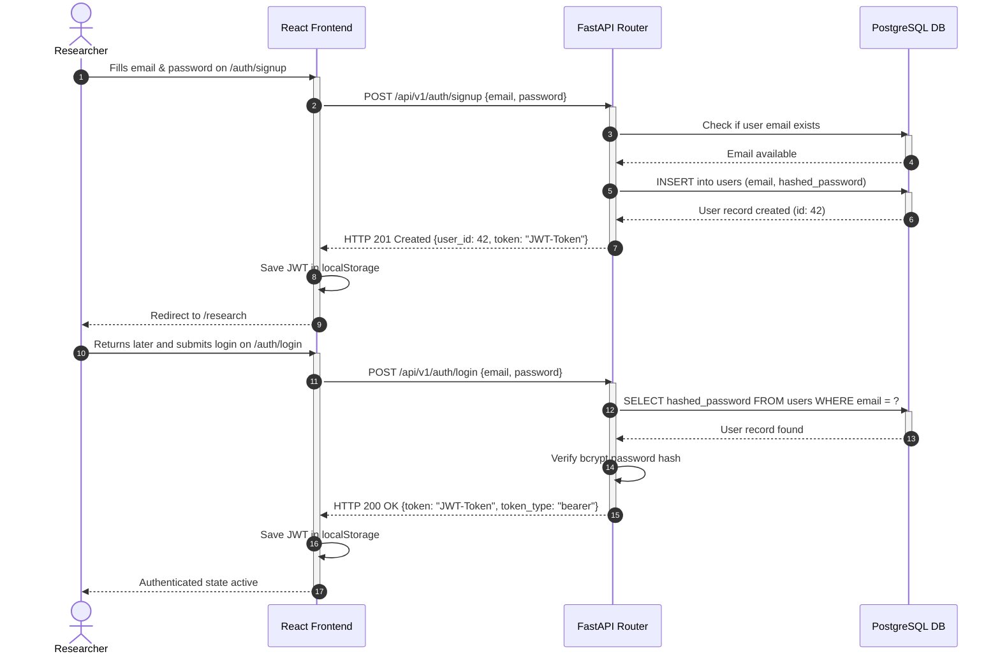
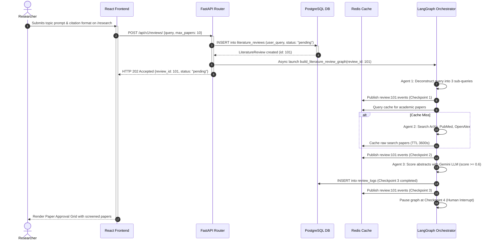
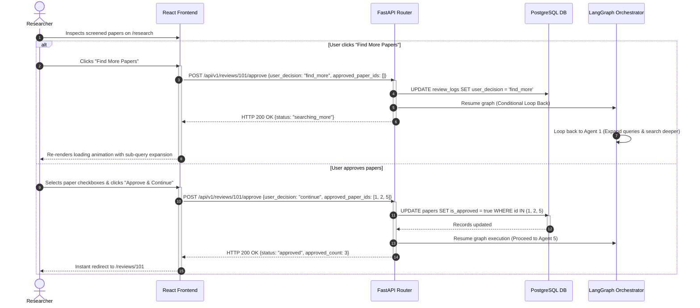
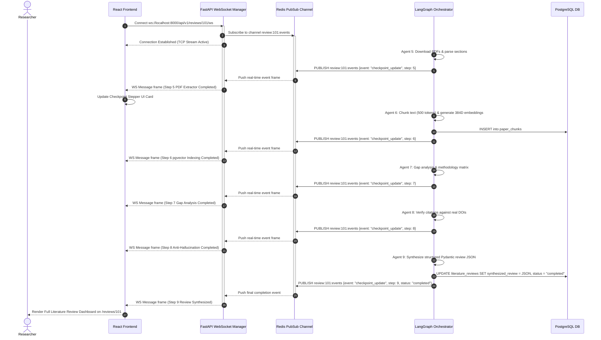
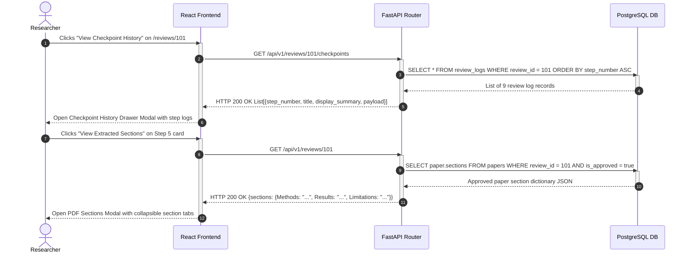
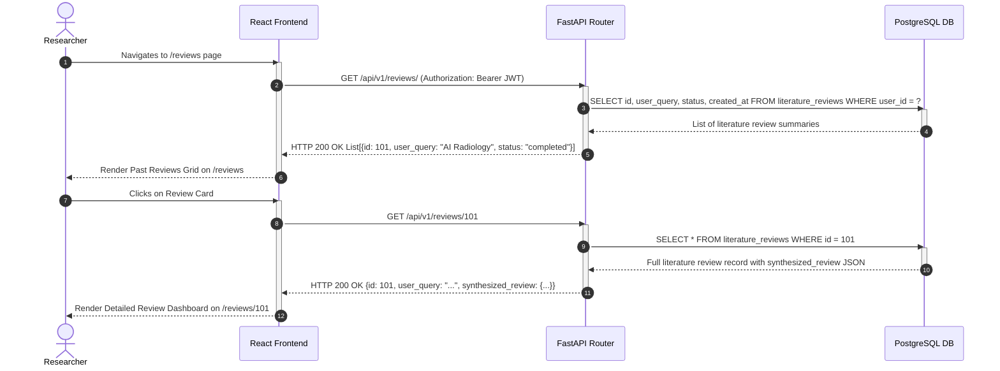
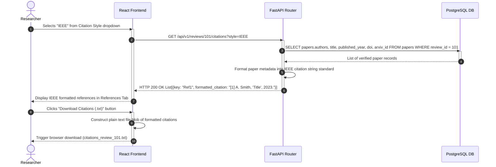

# Sequence Diagrams

This document contains end-to-end sequence diagrams detailing user authentication, search initialization, human-in-the-loop paper approval, real-time WebSocket event streaming, modal inspection, review retrieval, and multi-style citation downloads.

## 📌 Table of Contents
1. [1. User Authentication Flow](#1-user-authentication-flow)
2. [2. Research Initialization & Early Screening](#2-research-initialization--early-screening)
3. [3. Human-in-the-Loop Approval & "Find More" Loop](#3-human-in-the-loop-approval--find-more-loop)
4. [4. Review Processing & Real-Time WebSocket Streaming](#4-review-processing--real-time-websocket-streaming)
5. [5. Checkpoint History & PDF Section Modal Data Fetching](#5-checkpoint-history--pdf-section-modal-data-fetching)
6. [6. Past Reviews Listing & Detail Retrieval](#6-past-reviews-listing--detail-retrieval)
7. [7. 5-Style Citation Selection & Download Flow](#7-5-style-citation-selection--download-flow)

---

## 1. User Authentication Flow

Sequence of HTTP calls for user signup, password hashing, JWT token issue, and protected endpoint authorization.

| Element | Meaning | Code Reference |
| :--- | :--- | :--- |
| `POST /api/v1/auth/signup` | Planned signup route handler | [backend/app/models/user.py](../../backend/app/models/user.py) |
| `POST /api/v1/auth/login` | Planned login route handler | [backend/app/models/user.py](../../backend/app/models/user.py) |
| `users` | User identity ORM model | [backend/app/models/user.py](../../backend/app/models/user.py) |

---

## 2. Research Initialization & Early Screening

Sequence showing initial topic prompt submission, review creation in database, and initial candidate paper screening (Checkpoints 1-3).

| Element | Meaning | Code Reference |
| :--- | :--- | :--- |
| `POST /api/v1/reviews/` | Create review task endpoint | [backend/app/api/v1/reviews.py](../../backend/app/api/v1/reviews.py#L33) |
| `build_literature_review_graph()` | Orchestrator state graph compilation | [backend/app/agents/orchestrator.py](../../backend/app/agents/orchestrator.py#L4) |
| `search_academic_papers()` | Multi-source literature fetcher | [backend/app/services/search_service.py](../../backend/app/services/search_service.py#L356) |

---

## 3. Human-in-the-Loop Approval & "Find More" Loop

Sequence showing human paper selection approval or triggering the conditional loop back to discover additional literature.

| Element | Meaning | Code Reference |
| :--- | :--- | :--- |
| `submitHumanDecision()` | Frontend approval dispatcher | [frontend/src/lib/api.ts](../../frontend/src/lib/api.ts#L34) |
| `POST /api/v1/reviews/{id}/approve` | Backend paper approval route | [backend/app/api/v1/reviews.py](../../backend/app/api/v1/reviews.py#L53) |
| `PaperGrid` | Interactive paper selection grid | [frontend/src/components/dashboard/paper-grid.tsx](../../frontend/src/components/dashboard/paper-grid.tsx) |

---

## 4. Review Processing & Real-Time WebSocket Streaming

Sequence showing real-time event streaming over WebSockets backed by Redis Pub/Sub as Agents 5 through 9 execute.

| Element | Meaning | Code Reference |
| :--- | :--- | :--- |
| `ws://.../reviews/{id}/ws` | WebSocket event streaming endpoint | [backend/app/api/v1/reviews.py](../../backend/app/api/v1/reviews.py) |
| `review:{id}:events` | Redis Pub/Sub event channel | [backend/app/services/redis_service.py](../../backend/app/services/redis_service.py) |
| `store_paper_chunks()` | RAG passage embedding generator (384D) | [backend/app/services/vector_service.py](../../backend/app/services/vector_service.py#L140) |

---

## 5. Checkpoint History & PDF Section Modal Data Fetching

Sequence showing user interactions with the mid-step checkpoint log audit drawer and PDF section popup modal.

| Element | Meaning | Code Reference |
| :--- | :--- | :--- |
| `GET /api/v1/reviews/{id}/checkpoints` | Audit trail endpoint | [backend/app/api/v1/reviews.py](../../backend/app/api/v1/reviews.py) |
| `download_and_extract_pdf()` | PDF section parser | [backend/app/services/pdf_service.py](../../backend/app/services/pdf_service.py#L185) |
| `review_logs` | Checkpoint log table | [backend/app/models/log.py](../../backend/app/models/log.py) |

---

## 6. Past Reviews Listing & Detail Retrieval

Sequence showing retrieval of historical review sessions on `/reviews` and loading detailed reports.

| Element | Meaning | Code Reference |
| :--- | :--- | :--- |
| `GET /api/v1/reviews/` | List user reviews endpoint | [backend/app/api/v1/reviews.py](../../backend/app/api/v1/reviews.py#L33) |
| `GET /api/v1/reviews/{id}` | Review detail endpoint | [backend/app/api/v1/reviews.py](../../backend/app/api/v1/reviews.py#L43) |
| `Dashboard.tsx` | Dashboard route view | [frontend/src/pages/Dashboard.tsx](../../frontend/src/pages/Dashboard.tsx) |

---

## 7. 5-Style Citation Selection & Download Flow

Sequence showing citation style selection (APA, IEEE, MLA, Harvard, Chicago) and client-side `.txt` plain text file export.

| Element | Meaning | Code Reference |
| :--- | :--- | :--- |
| `citationOptions` | 5-style dropdown configuration | [frontend/src/components/ResearchInput.tsx](../../frontend/src/components/ResearchInput.tsx#L109-L115) |
| `GET /api/v1/reviews/{id}/citations` | Citation formatting API route | [backend/app/api/v1/reviews.py](../../backend/app/api/v1/reviews.py) |
| `CustomDropdown` | Dropdown selector component | [frontend/src/components/ResearchInput.tsx](../../frontend/src/components/ResearchInput.tsx#L9) |
