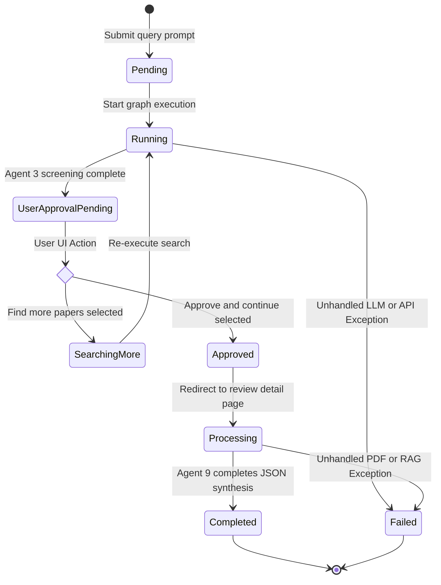
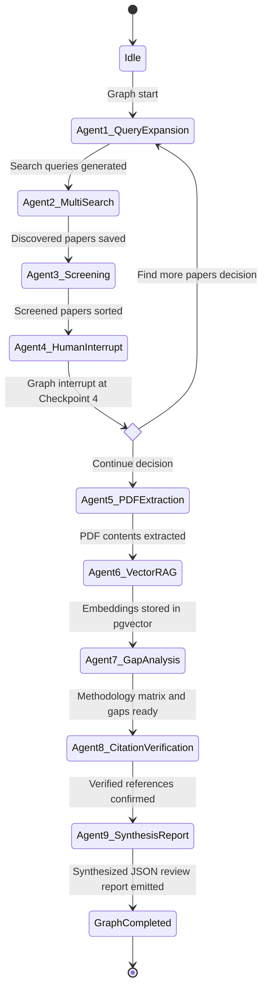
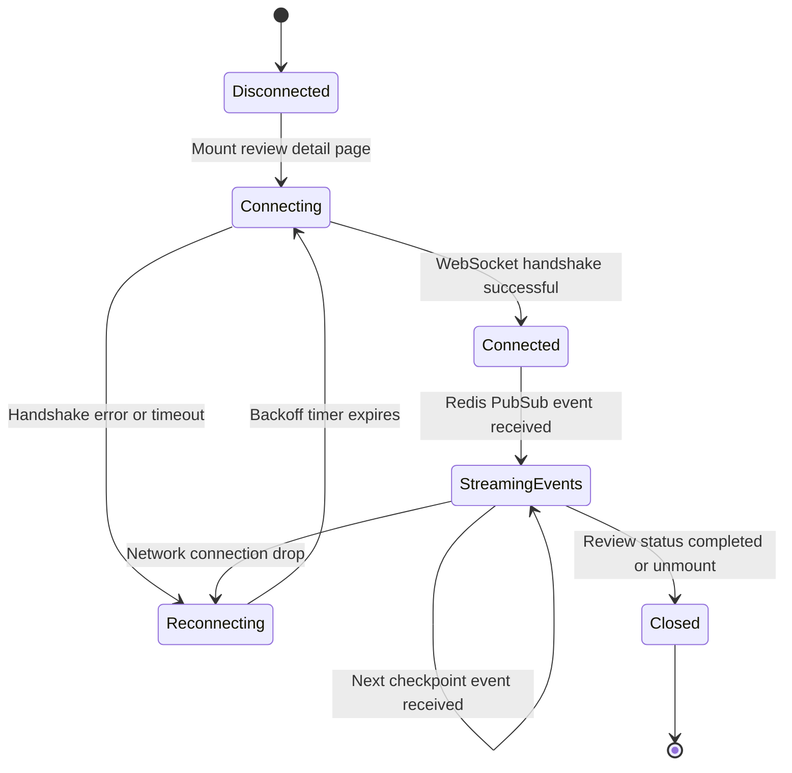
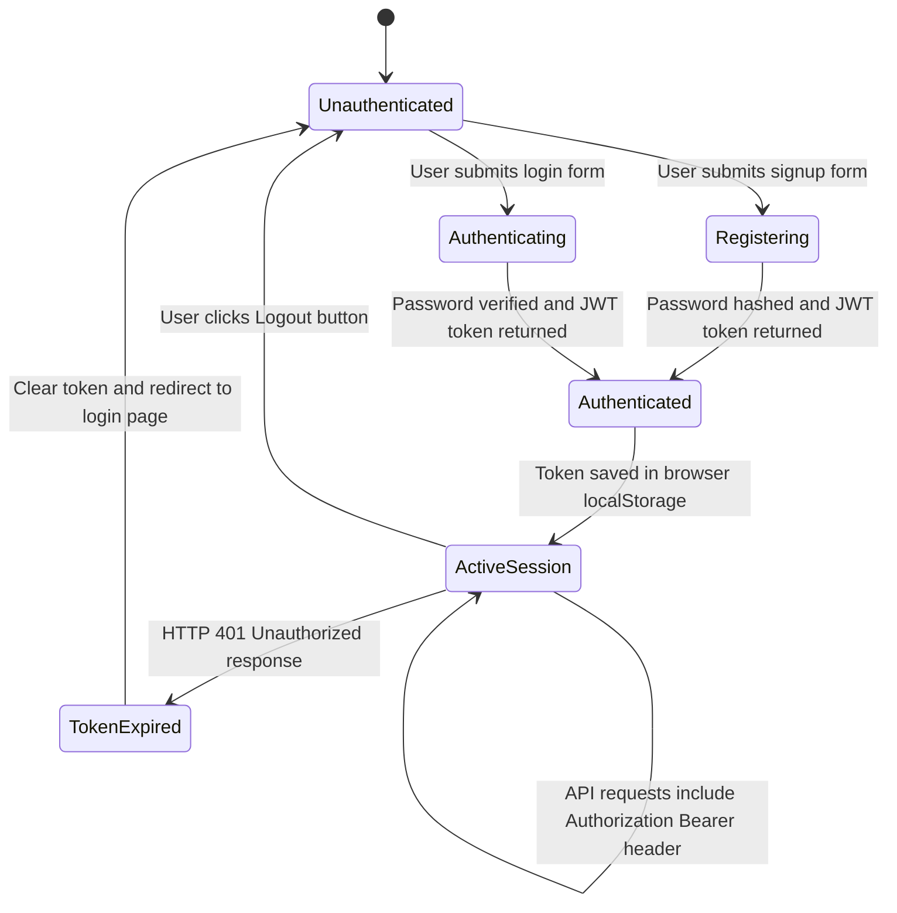
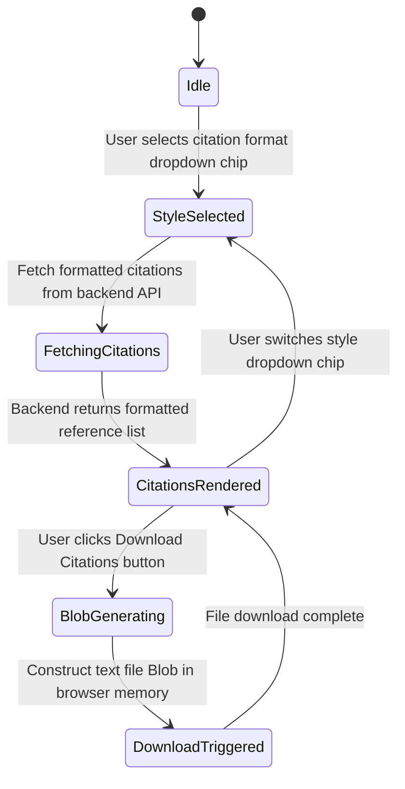

# State Diagrams

This document contains state transition diagrams for literature review session lifecycles, LangGraph multi-agent pipeline execution, WebSocket connection streaming, user authentication, and citation export.

## 📌 Table of Contents
1. [1. Literature Review Session Lifecycle State](#1-literature-review-session-lifecycle-state)
2. [2. LangGraph Multi-Agent Pipeline Execution State](#2-langgraph-multi-agent-pipeline-execution-state)
3. [3. WebSocket Connection & Real-Time Event Streaming State](#3-websocket-connection--real-time-event-streaming-state)
4. [4. User Authentication & Session Security State](#4-user-authentication--session-security-state)
5. [5. 5-Style Citation Selection & Export State](#5-5-style-citation-selection--export-state)

---

## 1. Literature Review Session Lifecycle State

State machine depicting the lifecycle transitions of a `LiteratureReview` session record from prompt submission to synthesis completion or failure.

| State | Meaning | Code reference (file path) |
|---|---|---|
| `Pending` | Initial DB record created upon query submission | [backend/app/models/review.py](../../backend/app/models/review.py#L27) |
| `Running` | Search and abstract screening pipeline active | [backend/app/api/v1/reviews.py](../../backend/app/api/v1/reviews.py#L40) |
| `UserApprovalPending` | Graph interrupted waiting for paper selection | [backend/app/api/v1/reviews.py](../../backend/app/api/v1/reviews.py#L48) |
| `SearchingMore` | Re-entering search loop for expanded papers | [backend/app/agents/orchestrator.py](../../backend/app/agents/orchestrator.py) |
| `Approved` | Papers approved and transition authorized | [backend/app/api/v1/reviews.py](../../backend/app/api/v1/reviews.py#L59) |
| `Processing` | PDF extraction, RAG indexing, and report synthesis active | [backend/app/services/pdf_service.py](../../backend/app/services/pdf_service.py) |
| `Completed` | Final structured review report stored in DB | [backend/app/models/review.py](../../backend/app/models/review.py#L28) |
| `Failed` | Terminal error state during graph execution | [backend/app/models/review.py](../../backend/app/models/review.py) |

> ⚠️ **Code vs. Plan Mismatch Note:** `backend/app/models/review.py` defines `status` as a `String(50)` with default `'pending'`, while `backend/app/api/v1/reviews.py` returns transient runtime statuses `'accepted'`, `'user_approval_pending'`, and `'approved'`.

---

## 2. LangGraph Multi-Agent Pipeline Execution State

State machine depicting execution flow across the 9 specialized agents in the LangGraph graph memory.

| State | Meaning | Code reference (file path) |
|---|---|---|
| `Idle` | Orchestrator awaiting execution request | [backend/app/agents/orchestrator.py](../../backend/app/agents/orchestrator.py#L4) |
| `Agent1_QueryExpansion` | Generating sub-queries & target domains | [backend/app/agents/state.py](../../backend/app/agents/state.py) |
| `Agent2_MultiSearch` | Querying ArXiv, PubMed, OpenAlex & deduplicating | [backend/app/services/search_service.py](../../backend/app/services/search_service.py#L356) |
| `Agent3_Screening` | Evaluating Gemini LLM relevance scores (>= 0.6) | [backend/app/agents/nodes/screening_node.py](../../backend/app/agents/nodes/screening_node.py) |
| `Agent4_HumanInterrupt` | LangGraph human-in-the-loop pause node | [backend/app/agents/orchestrator.py](../../backend/app/agents/orchestrator.py) |
| `Agent5_PDFExtraction` | Downloading open-access PDFs & parsing sections | [backend/app/services/pdf_service.py](../../backend/app/services/pdf_service.py#L185) |
| `Agent6_VectorRAG` | 500-token chunking & 384D pgvector embedding | [backend/app/services/vector_service.py](../../backend/app/services/vector_service.py#L140) |
| `Agent7_GapAnalysis` | Semantic search for experimental paradigms & gaps | [backend/app/agents/state.py](../../backend/app/agents/state.py) |
| `Agent8_CitationVerification` | Cross-checking DOIs against OpenAlex & Crossref | [backend/app/agents/nodes/synthesis_node.py](../../backend/app/agents/nodes/synthesis_node.py) |
| `Agent9_SynthesisReport` | Generating final Pydantic JSON review report | [backend/app/agents/nodes/synthesis_node.py](../../backend/app/agents/nodes/synthesis_node.py) |
| `GraphCompleted` | Pipeline execution terminated cleanly | [backend/app/agents/orchestrator.py](../../backend/app/agents/orchestrator.py) |

---

## 3. WebSocket Connection & Real-Time Event Streaming State

Client-side WebSocket connection lifecycle state machine for streaming live progress updates.

| State | Meaning | Code reference (file path) |
|---|---|---|
| `Disconnected` | No active WebSocket socket connection | [frontend/src/pages/ReviewDetail.tsx](../../frontend/src/pages/ReviewDetail.tsx) |
| `Connecting` | Initiating TCP handshake with ws://.../ws | [frontend/src/pages/ReviewDetail.tsx](../../frontend/src/pages/ReviewDetail.tsx) |
| `Connected` | WebSocket channel established and ready | [backend/app/services/redis_service.py](../../backend/app/services/redis_service.py) |
| `StreamingEvents` | Receiving real-time checkpoint_update JSON frames | [backend/app/services/redis_service.py](../../backend/app/services/redis_service.py#L59) |
| `Reconnecting` | Attempting automatic socket reconnection with exponential backoff | [frontend/src/pages/ReviewDetail.tsx](../../frontend/src/pages/ReviewDetail.tsx) |
| `Closed` | Socket connection gracefully terminated | [frontend/src/pages/ReviewDetail.tsx](../../frontend/src/pages/ReviewDetail.tsx) |

---

## 4. User Authentication & Session Security State

User authentication state machine managing session status, JWT token generation, and authorization header injection.

| State | Meaning | Code reference (file path) |
|---|---|---|
| `Unauthenticated` | Guest user mode with no JWT token stored | [frontend/src/lib/api.ts](../../frontend/src/lib/api.ts) |
| `Registering` | Submitting new user credentials (POST /api/v1/auth/signup) | [backend/app/api/v1/auth.py](../../backend/app/api/v1/auth.py#L12) |
| `Authenticating` | Validating user credentials (POST /api/v1/auth/login) | [backend/app/api/v1/auth.py](../../backend/app/api/v1/auth.py#L22) |
| `Authenticated` | JWT token received and validated | [backend/app/models/user.py](../../backend/app/models/user.py) |
| `ActiveSession` | Bearer token automatically attached to all API requests | [frontend/src/lib/api.ts](../../frontend/src/lib/api.ts#L18) |
| `TokenExpired` | Session token invalid or expired (HTTP 401) | [frontend/src/pages/Dashboard.tsx](../../frontend/src/pages/Dashboard.tsx) |

---

## 5. 5-Style Citation Selection & Export State

State machine depicting citation style selection and plain text file download in browser memory.

| State | Meaning | Code reference (file path) |
|---|---|---|
| `Idle` | References dashboard tab active in default view | [frontend/src/components/ResearchInput.tsx](../../frontend/src/components/ResearchInput.tsx#L109) |
| `StyleSelected` | Selected citation format (APA, IEEE, MLA, Harvard, Chicago) | [frontend/src/components/ResearchInput.tsx](../../frontend/src/components/ResearchInput.tsx#L9) |
| `FetchingCitations` | Requesting formatted citations from backend API | [backend/app/api/v1/reviews.py](../../backend/app/api/v1/reviews.py) |
| `CitationsRendered` | Displaying reference strings in UI list view | [frontend/src/pages/ReviewDetail.tsx](../../frontend/src/pages/ReviewDetail.tsx) |
| `BlobGenerating` | Building plain text file Blob in browser memory | [frontend/src/pages/ReviewDetail.tsx](../../frontend/src/pages/ReviewDetail.tsx) |
| `DownloadTriggered` | Programmatically triggering .txt file download | [frontend/src/pages/ReviewDetail.tsx](../../frontend/src/pages/ReviewDetail.tsx) |
