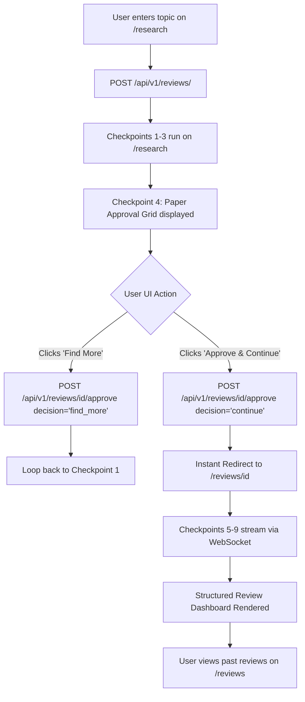

# Frontend Documentation

This document serves as the complete operational guide for frontend developers working on the Scholaris Multi-Agent Research Assistant interface.

## 📌 Table of Contents
1. [Purpose & Scope](#1-purpose--scope)
2. [Folder Structure](#2-folder-structure)
3. [Tech Stack](#3-tech-stack)
4. [Setup & Running Commands](#4-setup--running-commands)
5. [Environment Variables](#5-environment-variables)
6. [Routes & Page Architecture](#6-routes--page-architecture)
7. [Navigation Page Flow](#7-navigation-page-flow)
8. [Core Component System](#8-core-component-system)
9. [Checkpoint UI Mapping](#9-checkpoint-ui-mapping)
10. [State Management, API & WebSocket Client](#10-state-management-api--websocket-client)
11. [Authentication Handling](#11-authentication-handling)
12. [Citation Style Dropdown & Download Behavior](#12-citation-style-dropdown--download-behavior)
13. [Common Troubleshooting Issues](#13-common-troubleshooting-issues)
14. [Pre-PR Checklist](#14-pre-pr-checklist)
15. [Open Questions & Code Mismatches](#15-open-questions--code-mismatches)

---

## 1. Purpose & Scope

The frontend web application is a single-page React interface built with Vite, TypeScript, and Tailwind CSS. It provides interactive research prompt entry, real-time 9-checkpoint timeline card updates, a human-in-the-loop paper approval grid, review report dashboards, and multi-format citation downloads.

---

## 2. Folder Structure

```
frontend/
├── src/
│   ├── components/      # UI components (ResearchInput, Navbar, Footer, PaperSummaryCard)
│   │   ├── dashboard/   # Dashboard views (paper-grid.tsx)
│   │   └── ui/          # Generic UI primitives (Button, Dropdown)
│   ├── data/            # Mock paper and checkpoint fallback datasets
│   ├── images/          # Static branding graphics and SVG assets
│   ├── layouts/         # Shared page layout wrappers
│   ├── lib/             # API client helpers (api.ts) and utility functions (utils.ts)
│   ├── pages/           # Route views (Home.tsx, Dashboard.tsx, ReviewDetail.tsx)
│   ├── styles/          # Tailwind CSS styling tokens
│   ├── types/           # TypeScript interface definitions
│   ├── App.tsx          # React Router route registry
│   └── main.tsx         # React application entrypoint
├── index.html           # Single Page Application HTML root template
├── package.json         # React 19, Vite 6, Tailwind 4 dependencies manifest
└── vite.config.ts       # Vite bundler configuration
```

---

## 3. Tech Stack

| Technology | Version | Purpose in Frontend |
| :--- | :--- | :--- |
| **React** | `^19.1.0` | UI component rendering library |
| **Vite** | `^6.3.5` | Fast ESM development server and production bundler |
| **TypeScript** | `~5.8.3` | Static typing and interface safety |
| **React Router** | `^7.6.2` | Client-side routing and page view transitions |
| **Tailwind CSS** | `^4.1.8` | Responsive utility-first CSS styling framework |
| **Framer Motion** | `^13.4.4` | Loading animations and micro-interactions |
| **Clsx / Tailwind Merge** | `^2.1.1` / `^3.7.0` | Utility class merging and conditional styling |

---

## 4. Setup & Running Commands

### a) Manual Execution

```bash
# Navigate to frontend package directory
cd frontend

# Install Node.js dependencies
npm install

# Launch Vite development server (http://localhost:3000)
npm run dev

# Compile production bundle
npm run build

# Preview production build locally
npm run preview
```

### b) Docker Execution

```bash
# Build and run frontend container stack
docker compose up --build -d frontend

# View live frontend container logs
docker compose logs -f frontend
```

---

## 5. Environment Variables

| Variable Name | Required | Default Value | Description |
| :--- | :--- | :--- | :--- |
| `VITE_API_URL` | **Yes** | `http://localhost:8000/api/v1` | Backend REST and WebSocket API base URL ([frontend/src/lib/api.ts](../frontend/src/lib/api.ts#L3)) |

---

## 6. Routes & Page Architecture

| Route Path | Purpose | Key Components | Backend API Used |
| :--- | :--- | :--- | :--- |
| `/` / `/research` | Prompt entry & Paper Approval Grid | `ResearchInput`, `PaperGrid`, `CustomDropdown` | `POST /api/v1/reviews/`, `POST /api/v1/reviews/{id}/approve` |
| `/reviews/:id` | Live checkpoint stepper & review dashboard | `TimelineStepper`, `CheckpointModal`, `PDFSectionModal` | `GET /api/v1/reviews/{id}`, `ws://.../ws` |
| `/reviews` | Past literature reviews list | `PastReviewsGrid`, `ReviewCard` | `GET /api/v1/reviews/` |
| `/auth/login` | User authentication login page | `LoginForm`, `Input` | `POST /api/v1/auth/login` |
| `/auth/signup` | User authentication signup page | `SignupForm`, `Input` | `POST /api/v1/auth/signup` |

---

## 7. Navigation Page Flow



---

## 8. Core Component System

| Component Name | Source Location | Props / Data Interface | Description |
| :--- | :--- | :--- | :--- |
| `ResearchInput` | [ResearchInput.tsx](../frontend/src/components/ResearchInput.tsx) | `onSearch`, `isLoading` | Research query textarea, file attachment button, paper count & citation dropdowns |
| `CustomDropdown` | [ResearchInput.tsx](../frontend/src/components/ResearchInput.tsx#L9) | `label`, `value`, `options`, `onChange` | Reusable pill dropdown chip selector for options |
| `PaperGrid` | [paper-grid.tsx](../frontend/src/components/dashboard/paper-grid.tsx) | `papers`, `selectedPaperIds`, `onToggleSelect`, `onProceed`, `onFindMore` | Screened papers grid with selection checkmarks and approval action buttons |
| `TimelineStepper` | `components/dashboard/TimelineStepper.tsx` | `checkpoints: CheckpointLog[]`, `activeStep` | Live vertical stepper showing progress of all 9 agent checkpoints |
| `CheckpointModal` | `components/dashboard/CheckpointModal.tsx` | `isOpen`, `history: CheckpointLog[]`, `onClose` | Mid-step drawer modal listing complete checkpoint audit history |
| `PDFSectionModal` | `components/dashboard/PDFSectionModal.tsx` | `isOpen`, `sections: Dict[str, str]`, `onClose` | Popup modal displaying extracted PDF sections (*Methods, Results, Limitations*) |
| `ReviewDashboardTabs`| `components/dashboard/ReviewDashboardTabs.tsx` | `synthesizedReview: SynthesizedReview` | Tabbed literature review renderer (*Executive Summary, Themes, Gaps, References*) |

---

## 9. Checkpoint UI Mapping

| Step # | Agent Name | Timeline Card Title | Display Summary | Special UI Element |
| :---: | :--- | :--- | :--- | :--- |
| **01** | **Query Expansion** | Query Expanded & Classified | Sub-queries generated: *"AI diagnostic models"*, *"DL radiology"* | Sub-query topic pills |
| **02** | **Multi-Source Search** | Academic Literature Search | Found 24 candidate papers across ArXiv, PubMed & OpenAlex | Database source badges |
| **03** | **Screening Agent** | Relevance Filter Completed | Screened 24 papers $\rightarrow$ 10 relevant papers retained (Avg score: 0.88) | Relevance badge ($\ge 0.6$) |
| **04** | **Human Approval** | Human-in-the-Loop Selection | Waiting for user paper approval | **Interactive Paper Approval Grid** on `/research` |
| **05** | **PDF Extractor** | Full-Text PDF Extraction | Extracted full text & structured sections for 5 approved PDFs | **"📄 View Extracted Sections" Modal Button** |
| **06** | **`pgvector` RAG** | Vector Indexing & RAG Store | Generated 84 500-token embeddings & stored in pgvector | Passage count badge |
| **07** | **Gap Analysis** | Methodology Matrix & Gap Analysis | Extracted 3 experimental paradigms & identified 2 research gaps | Method & Gap overview |
| **08** | **Citation Verifier** | Anti-Hallucination Verification | Verified 100% of references against real DOIs | DOI grounding checkmark |
| **09** | **Synthesis Agent** | Literature Review Synthesized | Final structured JSON literature review generated successfully | **Structured Review Dashboard** |

---

## 10. State Management, API & WebSocket Client

| Module / Utility | Source Location | Implementation & Behavior |
| :--- | :--- | :--- |
| **REST API Client** | [frontend/src/lib/api.ts](../frontend/src/lib/api.ts) | Async `fetch` helpers for `createReviewTask()`, `getReviewStatus()`, and `submitHumanDecision()` |
| **WebSocket Client** | `pages/ReviewDetail.tsx` | Subscribes to `ws://localhost:8000/api/v1/reviews/{id}/ws` for sub-5ms `checkpoint_update` frames |
| **Local Component State** | [Dashboard.tsx](../frontend/src/pages/Dashboard.tsx) | Manages `selectedPaperIds`, `isSearching`, `isProceeding`, and `approvalSuccess` UI states |

---

## 11. Authentication Handling

- **Authentication Pages**: `/auth/login` and `/auth/signup` forms collecting email and password.
- **Session Persistence**: JWT bearer token stored in `localStorage` under key `token`.
- **Request Authorization**: Attached as `Authorization: Bearer <token>` in HTTP headers via [api.ts](../frontend/src/lib/api.ts).
- **Protected Routes**: Client-side router layout checks token existence; redirects unauthenticated users to `/auth/login`.

---

## 12. Citation Style Dropdown & Download Behavior

- **Citation Formats**: 5 options defined in `citationOptions` ([ResearchInput.tsx](../frontend/src/components/ResearchInput.tsx#L109-L115)): **APA**, **IEEE**, **MLA**, **Harvard**, **Chicago**.
- **User Selection**: Configured via `CustomDropdown` chip during initial prompt entry or directly inside the review report dashboard.
- **API Fetching**: Query parameter passed to `GET /api/v1/reviews/{id}/citations?style=APA`.
- **Download Handler**: Clicking **"Download Citations"** triggers client-side `.txt` file creation containing formatted reference strings.

---

## 13. Common Troubleshooting Issues

| Problem | Cause | Fix |
| :--- | :--- | :--- |
| `CORS error on API request` | FastAPI backend missing `http://localhost:3000` in CORS middleware | Update CORS allowed origins in `backend/app/main.py` |
| `WebSocket connection failed` | Port mismatch or invalid WS endpoint URL | Verify `VITE_API_URL` variable in `.env` |
| `TypeScript build failure` | Unresolved interface type mismatch in React 19 components | Run `npx tsc --noEmit` locally to identify type errors |

---

## 14. Pre-PR Checklist

Before submitting a Pull Request, verify:
- [ ] Executed `npm run build` with 0 TypeScript compilation errors.
- [ ] Tested paper selection toggling and approval submission flow on `/research`.
- [ ] Verified citation dropdown formatting for all 5 styles (APA, IEEE, MLA, Harvard, Chicago).
- [ ] Confirmed mobile-responsive layouts across breakpoints.

---

## 15. Open Questions & Code Mismatches

| Topic | Codebase Value | Implementation Plan Value | Action Required |
| :--- | :--- | :--- | :--- |
| **Frontend Framework** | React 19 + Vite 6 ([package.json](../frontend/package.json#L14-L27)) | Next.js / React | Confirm Vite Single Page Application architecture vs Next.js SSR |
| **Environment Variable Key** | `VITE_API_URL` in [api.ts](../frontend/src/lib/api.ts#L3) | `NEXT_PUBLIC_API_URL` in `.env.example` | Standardize on `VITE_API_URL` for Vite project configuration |
| **Approval Endpoint Path** | `POST /api/v1/reviews/${reviewId}/approve` in [api.ts](../frontend/src/lib/api.ts#L39) | `POST /api/v1/reviews/approve` in [health.py](../../backend/app/api/v1/health.py#L76) | Align backend paper approval endpoint signature to accept `reviewId` |
