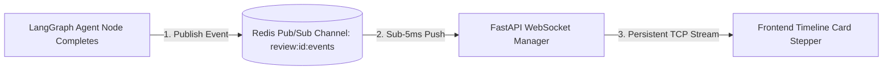

# 📚 Master System Architecture & UX Implementation Blueprint

> **System**: Autonomous Human-in-the-Loop Multi-Agent Academic Research Assistant
> **Core Stack**: LangGraph, FastAPI, Google Gemini (`gemini-3.1-flash-lite`), PostgreSQL + `pgvector`, Redis Pub/Sub, WebSockets, Next.js / React

---

## 🗺️ 1. Complete End-to-End System Activity Diagram (9 Agents)

```mermaid
flowchart TD
    classDef startEnd fill:#2563eb,color:#fff,stroke:#1d4ed8,stroke-width:2px;
    classDef agentNode fill:#0284c7,color:#fff,stroke:#0369a1,stroke-width:2px;
    classDef humanNode fill:#d97706,color:#fff,stroke:#b45309,stroke-width:2px;
    classDef decisionNode fill:#4f46e5,color:#fff,stroke:#4338ca,stroke-width:2px;
    classDef dbNode fill:#059669,color:#fff,stroke:#047857,stroke-width:2px;

    Start([User Submits Query on /research]):::startEnd --> InitState[0. Orchestrator Initializes AgentState Memory]:::dbNode

    subgraph Agent_01 ["🤖 Agent 1: Query Expansion & Domain Classifier Agent"]
        InitState --> ClassifyDomain[1. Classify Domain: CS / Bio / Interdisciplinary]:::agentNode
        ClassifyDomain --> ExpandSubQueries[2. Deconstruct query into 3-5 sub-queries & select API targets]:::agentNode
        ExpandSubQueries --> ExpandState[Update state: target_domains & search_queries]:::dbNode
    end

    subgraph Agent_02 ["🤖 Agent 2: Smart Domain-Routed Search & Discovery Agent"]
        ExpandState --> RouteDomain{Query Domain Target?}:::decisionNode
        RouteDomain -->|CS / AI / Physics| FetchCS[Query ArXiv, OpenAlex & IEEE]:::agentNode
        RouteDomain -->|Bio / Medicine / Clinical| FetchBio[Query PubMed, bioRxiv/medRxiv & Europe PMC]:::agentNode
        RouteDomain -->|Interdisciplinary| FetchGeneral[Query OpenAlex & Crossref]:::agentNode

        FetchCS --> Deduplicate[Deduplicate Raw Papers by DOI, ArXiv ID, PMID, or Title]:::agentNode
        FetchBio --> Deduplicate
        FetchGeneral --> Deduplicate

        Deduplicate --> SearchState[Update state: discovered_papers]:::dbNode
    end

    subgraph Agent_03 ["🤖 Agent 3: Screening & Relevance Filter Agent"]
        SearchState --> EvaluateAbstracts[Evaluate query vs abstract relevance with Gemini LLM]:::agentNode
        EvaluateAbstracts --> ScreenFilter{Relevance Score >= 0.6?}:::decisionNode
        ScreenFilter -->|Yes| RetainPaper[Keep paper & attach relevance score + reasoning]:::agentNode
        ScreenFilter -->|No| DiscardPaper[Filter out off-topic paper]:::agentNode
        RetainPaper --> ScreenState[Update state: screened_papers sorted by score]:::dbNode
    end

    ScreenState --> HumanPause

    subgraph Agent_04 ["👤 Agent 4: Human-in-the-Loop Approval Interrupt Node"]
        HumanPause[PAUSE PIPELINE: Display Screened Papers Grid on /research]:::humanNode --> UserReview[User inspects abstracts & selects approved papers]:::humanNode
        UserReview --> UserDecision{User UI Action?}:::decisionNode
    end

    UserDecision -->|Clicks 'Find More Papers'| RouteMore[Set state user_decision = 'find_more']:::dbNode
    RouteMore -->|Conditional Edge Loop Back| ClassifyDomain

    UserDecision -->|Clicks 'Approve & Continue'| RouteApprove[Set state user_decision = 'continue' & approved_papers]:::dbNode
    RouteApprove --> RedirectReview[POST /api/v1/reviews/approve -> Instant Redirect to /reviews/id]:::startEnd

    RedirectReview --> PDFDownload

    subgraph Agent_05 ["🤖 Agent 5: Full-Text PDF Downloader & Extractor"]
        PDFDownload[Download open-access PDFs to AWS S3 bucket]:::agentNode --> ExtractSections[Parse PDF text into sections: Intro, Methods, Results, Discussion, Limitations]:::agentNode
        ExtractSections --> PDFState[Update state: extracted_pdf_contents & DB paper.sections]:::dbNode
    end

    subgraph Agent_06 ["🤖 Agent 6: Vector Chunking & pgvector RAG Embedding Agent"]
        PDFState --> ChunkText[Chunk paper text into 500-token passages]:::agentNode
        ChunkText --> GenEmbeddings[Generate 1536-dim vector embeddings]:::agentNode
        GenEmbeddings --> StoreVector[(Store Embeddings & Passages in PostgreSQL pgvector paper_chunks)]:::dbNode
    end

    subgraph Agent_07 ["🤖 Agent 7: Methodology Matrix & Gap Analysis Agent"]
        StoreVector --> VectorRetrieval[Perform semantic similarity search for methods & limitations]:::agentNode
        VectorRetrieval --> MapMatrix[Compare experimental paradigms & extract unresolved gaps]:::agentNode
        MapMatrix --> GapState[Update state: methodology_matrix & research_gaps]:::dbNode
    end

    subgraph Agent_08 ["🤖 Agent 8: Multi-Database Citation & Anti-Hallucination Verifier"]
        GapState --> CrossCheckRefs[Cross-check generated citations against real DOIs, PMIDs & ArXiv IDs]:::agentNode
        CrossCheckRefs --> VerifyRef{Citation Valid & Grounded?}:::decisionNode
        VerifyRef -->|Valid| KeepRef[Attach verified citation key & canonical URL]:::agentNode
        VerifyRef -->|Hallucinated| FixRef[Correct citation metadata or remove ungrounded claim]:::agentNode
        KeepRef --> RefState[Update state: verified_references]:::dbNode
        FixRef --> RefState
    end

    subgraph Agent_09 ["🤖 Agent 9: Synthesis & Structured JSON Report Agent"]
        RefState --> LLMSynthesis[Pass verified data to Gemini LLM with Pydantic JSON Mode]:::agentNode
        LLMSynthesis --> GenJSON[Generate structured JSON report payload]:::agentNode
        GenJSON --> FinalState[Update state: synthesized_review & DB literature_reviews.synthesized_review]:::dbNode
    end

    FinalState --> Finish([Render Interactive Review Dashboard on /reviews/id]):::startEnd
```



---

## ⚡ 2. WebSocket & Ultra-Low Latency Event Streaming



- **Protocol**: WebSockets (`ws://localhost:8000/api/v1/reviews/{id}/ws`) backed by **Redis Pub/Sub**.
- **Latency**: Sub-5ms TCP push without polling overhead.
- **Event Payload Standard**:
  ```json
  {
    "event": "checkpoint_update",
    "review_id": 42,
    "checkpoint": 3,
    "status": "completed",
    "title": "Relevance Filter Completed",
    "display_summary": "Screened 24 papers → 10 relevant papers retained (Avg score: 0.88)",
    "payload": {
      "screened_count": 10,
      "top_score": 0.94
    },
    "timestamp": "2026-10-01T11:20:00Z"
  }
  ```

---

## 📊 3. Master Checkpoint Data Mapping Table (All 9 Agent Steps)

| Step # | Agent Name | Internal Raw AI Payload | Display Summary on Screen (Timeline Checkpoint Card) | Special UI Feature |
| :---: | :--- | :--- | :--- | :--- |
| **01** | **Query Expansion & Domain Classifier** | `search_queries: [...]`, `target_domains: ["cs", "bio"]` | **Title**: Query Expanded & Domain Classified<br>**Summary**: Sub-queries generated: *"AI diagnostic models"*, *"DL radiology"*, *"Clinical ML"* (Domain: *Biomedical*) | Live Sub-queries display |
| **02** | **Multi-Source Search** | `discovered_papers: [...]` (24 items) | **Title**: Academic Literature Search<br>**Summary**: *"Found 24 candidate papers across ArXiv, PubMed & OpenAlex"* | Source breakdown badge |
| **03** | **Screening Agent** | `screened_papers: [...]` (10 items) | **Title**: Relevance Filter Completed<br>**Summary**: *"Screened 24 papers $\rightarrow$ 10 relevant papers retained (Avg score: 0.88)"* | Relevance badge ($\ge 0.6$) |
| **04** | **Human Approval (Interrupt)** | `approved_papers: [...]`, `user_decision: "continue"` | **Title**: Human-in-the-Loop Selection<br>**Summary**: *"Waiting for user paper approval"* | **Interactive Paper Approval Grid** on `/research` |
| **05** | **PDF Extractor** | `extracted_pdf_contents: {sections: {methods: "...", results: "...", limitations: "..."}}` | **Title**: Full-Text PDF Extraction<br>**Summary**: *"Extracted full text & structured sections for 5 approved PDFs to AWS S3"* | **"📄 View Extracted Sections" Modal Button** |
| **06** | **`pgvector` RAG Agent** | `chunks: [...]` (84 passages) | **Title**: Vector Indexing & RAG Store<br>**Summary**: *"Generated 84 500-token embeddings & stored in PostgreSQL pgvector"* | Passage chunk count badge |
| **07** | **Gap Analysis Agent** | `methodology_matrix: [...], research_gaps: [...]` | **Title**: Methodology Matrix & Gap Analysis<br>**Summary**: *"Extracted 3 experimental paradigms & identified 2 unresolved research gaps"* | Method & Gap overview |
| **08** | **Citation Verifier** | `verified_references: [...]` | **Title**: Anti-Hallucination Citation Verification<br>**Summary**: *"Verified 100% of references against real DOIs (0 hallucinated citations)"* | DOI grounding checkmark |
| **09** | **Synthesis Agent** | `synthesized_review: {...}` | **Title**: Literature Review Synthesized<br>**Summary**: *"Final structured JSON literature review generated successfully"* | **Full Structured Literature Review Dashboard** |

---

## 🧭 4. Page Navigation & User Experience (UX) Blueprint

### **A. Research Page (`/research`)**
1. User enters topic prompt.
2. Checkpoints 1, 2, 3 run live with vertical timeline cards.
3. Checkpoint 4 displays the **Paper Approval Grid**.
4. User selects papers and clicks **"Approve & Generate Review"**.
5. App calls `POST /api/v1/reviews/{id}/approve` and **instantly redirects to `/reviews/[id]`**.

### **B. Review Detail Page (`/reviews/[id]`)**
1. Checkpoints 5, 6, 7, 8, 9 run live with real-time status cards.
2. Once complete, renders the **Full Structured Literature Review** with tabs:
   - 📝 **Executive Summary**
   - 🧩 **Thematic Clusters**
   - 📊 **Methodology Comparison Matrix**
   - ⚠️ **Research Gaps**
   - 📚 **Verified References**
3. **Mid-Step Log Modal**: Clicking **"🔍 View Checkpoint History"** opens a drawer/modal allowing the user to view past checkpoint outputs.
4. **PDF Section Popup**: Clicking **"📄 View Extracted Sections"** on Step 5 opens a modal with collapsible tabs (*Methods, Results, Limitations, Future Work*).

### **C. Past Reviews Page (`/reviews`)**
- Grid/list of all past literature reviews created by the user (designed with `user_id` multi-tenancy so user authentication can be attached seamlessly).

---

## 🎯 5. Feature Architecture Breakdown: Sprint 2 vs. Sprint 3

### **Sprint 2: Core Multi-Agent Pipeline & Checkpoint UI**
1. Multi-Agent Engine (Agents 1-9 in LangGraph).
2. WebSocket `/api/v1/reviews/{id}/ws` & Redis Pub/Sub streaming.
3. Database `review_logs` checkpoint storage.
4. `/research` Page (Checkpoints 1-3 + Paper Approval Grid).
5. `/reviews/[id]` Page (Checkpoints 5-9 + Structured Review Report + Checkpoint History Modal + PDF Section Popup).
6. `/reviews` Past Reviews Page.
7. Unify `ReviewStatus` Enum across database schema (`models/review.py`) and FastAPI endpoints (`api/v1/reviews.py`).

### **Sprint 3: Production Hardening & Advanced Features**
1. **User Authentication & Privacy**: JWT / NextAuth login linking reviews to `user_id`.
2. **Interactive D3.js Citation Knowledge Graph**: 3D visual network graph connecting papers by shared authors, themes, and methodologies.
3. **In-App PDF Reader with Inline Citation Highlighting**: Clicking a reference opens the PDF side-by-side and highlights the exact cited passage.
4. **One-Click Multi-Format Exporter**: Export report as **PDF**, **Markdown (`.md`)**, or **BibTeX (`.bib`)**.
